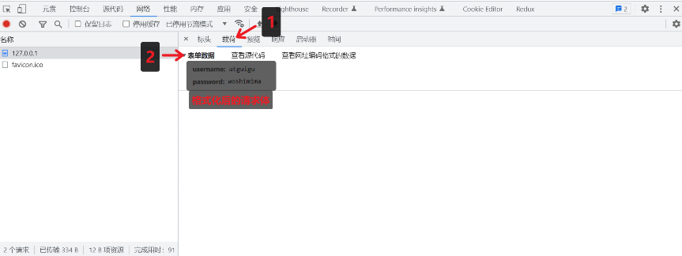

# Node 基础

# 入门注意点

1. Nodejs 中不能使用 BOM 和 DOM 的 API
2. 顶级对象用 global

# Buffer（缓冲器）

1. ## 概念

Buffer 是一个类似于数组的 对象 ，用于表示固定长度的字节序列

Buffer 本质是一段内存空间，专门用来处理 二进制数据 。


1. ## 特点

1. Buffer 大小固定且无法调整
1. Buffer 性能较好，可以直接对计算机内存进行操作
1. 每个元素的大小为 1 字节（byte）


1. ## 创建

1. ### 创建 buffer

1. alloc

```JavaScript
//创建了一个长度为 10 字节的 Buffer，相当于申请了 10 字节的内存空间，每个字节的值为 0
let buf_1 = Buffer.alloc(10); // 结果为 <Buffer 00 00 00 00 00 00 00 00 00 00>
```

1. allocUnsafe

```JavaScript
//创建了一个长度为 10 字节的 Buffer，buffer 中可能存在旧的数据, 可能会影响执行结果，所以叫 unsafe
let buf_2 = Buffer.allocUnsafe(10);
```

1. From

```JavaScript
//通过字符串创建 Buffer
let buf_3 = Buffer.from('hello');
//通过数组创建 Buffer
let buf_4 = Buffer.from([105, 108, 111, 118, 101, 121, 111, 117]);
```

1. ### **Buffer 与字符串的转化**

我们可以借助 toString 方法将 Buffer 转为字符串

```JavaScript
let buf_4 = Buffer.from([105, 108, 111, 118, 101, 121, 111, 117]);
console.log(buf_4.toString())
```

> toString 默认是按照 utf-8 编码方式进行转换的。

1. ### **Buffer 的读写**

Buffer 可以直接通过 的方式对数据进行处理。

```JavaScript
//读取
console.log(buf_3[1]);
//修改
buf_3[1] = 97;
//查看字符串结果
console.log(buf_3.toString());
```

> 1. 如果修改的数值超过 255 ，则超过 8 位数据会被舍弃
> 2. 一个 utf-8 的字符 一般 占 3 个字节

# fs 模块

fs 全称为 file system ，称之为 文件系统 ，是 Node.js 中的 内置模块 ，可以对计算
机中的磁盘进行操作。

1. ## 文件写入

1. ### **writeFile 异步写入**

语法： fs.writeFile(file, data[, options], callback)

参数说明：

- file 文件名
- data 待写入的数据
- options 选项设置 （可选）
- callback 写入回调
- 返回值： undefined

```JavaScript
// require 是 Node.js 环境中的'全局'变量，用来导入模块
const fs = require('fs');
//将 『三人行，必有我师焉。』 写入到当前文件夹下的『座右铭.txt』文件中
fs.writeFile('./座右铭.txt', '三人行，必有我师焉。', err => {
//如果写入失败，则回调函数调用时，会传入错误对象，如写入成功，会传入 null
if(err){
console.log(err);
return;
}
console.log('写入成功')；
});
```

1. ### **writeFileSync 同步写入**

语法: fs.writeFileSync(file, data[, options])

参数与 fs.writeFile 大体一致，只是没有 callback 参数

返回值： undefined

```JavaScript
try{
fs.writeFileSync('./座右铭.txt', '三人行，必有我师焉。');
}catch(e){
console.log(e);
}
```

> Node.js 中的磁盘操作是由其他 线程 完成的，结果的处理有两种模式：
>
> - 同步处理 JavaScript 主线程 会等待 其他线程的执行结果，然后再继续执行主线程的
>   代码， 效率较低
> - 异步处理 JavaScript 主线程 不会等待 其他线程的执行结果，直接执行后续的主线程
>   代码， 效率较好

1. ### **appendFile / appendFileSync 追加写入**

appendFile 作用是在文件尾部追加内容，appendFile 语法与 writeFile 语法完全相同

语法:

fs.appendFile(file, data[, options], callback)

fs.appendFileSync(file, data[, options])

返回值： 二者都为 undefined

```JavaScript
fs.appendFile('./座右铭.txt','择其善者而从之，其不善者而改之。', err => {
if(err) throw err;
console.log('追加成功')
});
fs.appendFileSync('./座右铭.txt','\r\n温故而知新, 可以为师矣');
```

1. ### **createWriteStream 流式写入**

语法： fs.createWriteStream(path[, options])

参数说明：

path 文件路径

options 选项配置（ 可选 ）

返回值： Object

```JavaScript
let ws = fs.createWriteStream('./观书有感.txt');
ws.write('半亩方塘一鉴开\r\n');
ws.write('天光云影共徘徊\r\n');
ws.write('问渠那得清如许\r\n');
ws.write('为有源头活水来\r\n');
ws.end();
```

> 程序打开一个文件是需要消耗资源的 ，流式写入可以减少打开关闭文件的次数。
>
> 流式写入方式适用于 大文件写入或者频繁写入 的场景, writeFile 适合于 写入频率较
> 低的场景

1. ### **写入文件的场景**

文件写入 在计算机中是一个非常常见的操作，下面的场景都用到了文件写入

- 下载文件
- 安装软件
- 保存程序日志，如 Git
- 编辑器保存文件
- 视频录制

> 当 需要持久化保存数据 的时候，应该想到 文件写入

1. ## **文件读取**

文件读取顾名思义，就是通过程序从文件中取出其中的数据，我们可以使用如下几种方式：

1. ### **readFile 异步读取**

语法： fs.readFile(path[, options], callback)

参数说明：

path 文件路径

options 选项配置

callback 回调函数

返回值： undefined

```JavaScript
//导入 fs 模块
const fs = require('fs');
fs.readFile('./座右铭.txt', (err, data) => {
if(err) throw err;
console.log(data);
});
fs.readFile('./座右铭.txt', 'utf-8',(err, data) => {
if(err) throw err;
console.log(data);
});
```

1. ### **readFileSync 同步读取**

语法： fs.readFileSync(path[, options])

参数说明：

path 文件路径

options 选项配置

返回值： string | Buffer

```JavaScript
let data = fs.readFileSync('./座右铭.txt');
let data2 = fs.readFileSync('./座右铭.txt', 'utf-8');
```

1. ### **createReadStream 流式读取**

语法： fs.createReadStream(path[, options])

参数说明：

- path 文件路径
- options 选项配置（ 可选 ）

返回值： Object

```JavaScript
//创建读取流对象
let rs = fs.createReadStream('./观书有感.txt');
//每次取出 64k 数据后执行一次 data 回调
rs.on('data', data => {
console.log(data);
console.log(data.length);
});
//读取完毕后, 执行 end 回调
rs.on('end', () => {
console.log('读取完成')
})
```

1. ### **读取文件应用场景**

电脑开机

- 程序运行
- 编辑器打开文件
- 查看图片
- 播放视频
- 播放音乐
- Git 查看日志
- 上传文件
- 查看聊天记录

1. ## **文件移动与重命名**

在 Node.js 中，我们可以使用 rename 或 renameSync 来移动或重命名 文件或文件夹

语法：

fs.rename(oldPath, newPath, callback)

fs.renameSync(oldPath, newPath)

参数说明：

- oldPath 文件当前的路径
- newPath 文件新的路径
- callback 操作后的回调

```JavaScript
fs.rename('./观书有感.txt', './论语/观书有感.txt', (err) =>{
if(err) throw err;
console.log('移动完成')
});
fs.renameSync('./座右铭.txt', './论语/我的座右铭.txt');
```

1. ## **文件删除**

在 Node.js 中，我们可以使用 unlink 或 unlinkSync 来删除文件

语法：

fs.unlink(path, callback)

fs.unlinkSync(path)

参数说明：

- path 文件路径
- callback 操作后的回调

```JavaScript
const fs = require('fs');
fs.unlink('./test.txt', err => {
if(err) throw err;
console.log('删除成功');
});
fs.unlinkSync('./test2.txt');
```

1. ## **文件夹操作**

借助 Node.js 的能力，我们可以对文件夹进行 创建 、 读取 、 删除 等操作

1. ### **mkdir 创建文件夹**

在 Node.js 中，我们可以使用 mkdir 或 mkdirSync 来创建文件夹

语法：

fs.mkdir(path[, options], callback)

fs.mkdirSync(path[, options])

参数说明：

- path 文件夹路径
- options 选项配置（ 可选 ）
- callback 操作后的回调

```JavaScript
//异步创建文件夹
fs.mkdir('./page', err => {
if(err) throw err;
console.log('创建成功');
});
//递归异步创建
fs.mkdir('./1/2/3', {recursive: true}, err => {
if(err) throw err;
console.log('递归创建成功');
});
//递归同步创建文件夹
fs.mkdirSync('./x/y/z', {recursive: true});
```

1. ### **readdir 读取文件夹**

在 Node.js 中，我们可以使用 readdir 或 readdirSync 来读取文件夹

语法：

fs.readdir(path[, options], callback)

fs.readdirSync(path[, options])

参数说明：

- path 文件夹路径
- options 选项配置（ 可选 ）
- callback 操作后的回调

```JavaScript
//异步读取
fs.readdir('./论语', (err, data) => {
if(err) throw err;
console.log(data);
});
//同步读取
let data = fs.readdirSync('./论语');
console.log(data);
```

1. ### **rmdir 删除文件夹**

在 Node.js 中，我们可以使用 rmdir 或 rmdirSync 来删除文件夹

语法：

fs.rmdir(path[, options], callback)

fs.rmdirSync(path[, options])

参数说明：

- path 文件夹路径
- options 选项配置（ 可选 ）
- callback 操作后的回调

```JavaScript
//异步删除文件夹
fs.rmdir('./page', err => {
if(err) throw err;
console.log('删除成功');
});
//异步递归删除文件夹
fs.rmdir('./1', {recursive: true}, err => {
if(err) {
console.log(err);
}
console.log('递归删除')
});
//同步递归删除文件夹
fs.rmdirSync('./x', {recursive: true})
```

1. ## **查看资源状态**

在 Node.js 中，我们可以使用 stat 或 statSync 来查看资源的详细信息

语法：

fs.stat(path[, options], callback)

fs.statSync(path[, options])

参数说明：

- path 文件夹路径
- options 选项配置（ 可选 ）
- callback 操作后的回调

```JavaScript
//异步获取状态
fs.stat('./data.txt', (err, data) => {
if(err) throw err;
console.log(data);
});
//同步获取状态
let data = fs.statSync('./data.txt');
```

结果值对象结构：

- size 文件体积
- birthtime 创建时间
- mtime 最后修改时间
- isFile 检测是否为文件
- isDirectory 检测是否为文件夹
- ......

1. ## **相对路径问题**

fs 模块对资源进行操作时，路径的写法有两种：

- 相对路径
  - ./座右铭.txt 当前目录下的座右铭.txt
  - 座右铭.txt 等效于上面的写法
  - ../座右铭.txt 当前目录的上一级目录中的座右铭.txt
- 绝对路径
  - D:/Program Files windows 系统下的绝对路径
  - /usr/bin Linux 系统下的绝对路径

> 相对路径中所谓的 当前目录 ，指的是 命令行的工作目录 ，而并非是文件的所在目录,
> 所以当命令行的工作目录与文件所在目录不一致时，会出现一些 BUG

1. ## **\_\_dirname**

\_\_dirname 与 require 类似，都是 Node.js 环境中的'全局'变量

**dirname 保存着 当前文件所在目录的绝对路径 ，可以使用 **dirname 与文件名拼接成
绝对路径

```JavaScript
let data = fs.readFileSync(__dirname + '/data.txt');
console.log(data);
```

> 使用 fs 模块的时候，尽量使用 \_\_dirname 将路径转化为绝对路径，这样可以避免相
> 对路径产生的 Bug

# path 模块

path 模块提供了 操作路径 的功能

```JavaScript
const path = require('path');
//获取路径分隔符
console.log(path.sep);
//拼接绝对路径
console.log(path.resolve(__dirname, 'test'));
//解析路径
let pathname = 'D:/program file/nodejs/node.exe';
console.log(path.parse(pathname));
//获取路径基础名称
console.log(path.basename(pathname))
//获取路径的目录名
console.log(path.dirname(pathname));
//获取路径的扩展名
console.log(path.extname(pathname));
```

# **HTTP 协议**

1. ## **概念**

HTTP（hypertext transport protocol）协议；中文叫**超文本传输协议**

是一种基于 TCP/IP 的应用层通信协议

这个协议详细规定了 浏览器 和万维网 服务器 之间互相通信的规则。

协议中主要规定了两个方面的内容

- 客户端：用来向服务器发送数据，可以被称之为**请求报文**
- 服务端：向客户端返回数据，可以被称之为**响应报文**

> 报文：可以简单理解为就是一堆字符串

1. ## **请求报文的组成**

- 请求行
- 请求头
- 空行
- 请求体

1. ## **HTTP 的请求行**

- 请求方法（get、post、put、delete 等）
- 请求 URL（统一资源定位器）

例如：**http://www.baidu.com:80/index.html?a=100&b=200#logo**

- http： 协议（https、ftp、ssh 等）
- **www.baidu.com** 域名
- 80 端口号
- /index.html 路径
- a=100&b=200 查询字符串
- \#logo 哈希（锚点链接）

- HTTP 协议版本号

1. ## **HTTP 请求头**

格式：『头名：头值』


1. ## **HTTP 的请求体**

请求体内容的格式是非常灵活的，

（可以是空）==> GET 请求，

（也可以是字符串，还可以是 JSON）===> POST 请求

例如：

- 字符串：keywords=手机&price=2000
- JSON：{"keywords":"手机","price":2000}

1. ## **响应报文的组成**

**响应行**

```Shell
HTTP/1.1 200 OK
```

- HTTP/1.1：HTTP 协议版本号
- 200：响应状态码 404 Not Found 500 Internal Server Error
- 还有一些状态码，参考
  ：**https://developer.mozilla.org/zh-CN/docs/Web/HTTP/Status**
- OK：响应状态描述

**响应头**

```Shell
Cache-Control:缓存控制 private 私有的，只允许客户端缓存数据
Connection 链接设置
Content-Type:text/html;charset=utf-8 设置响应体的数据类型以及字符集,响应体为html，字符集
utf-8
Content-Length:响应体的长度，单位为字节
```

**空行**

**响应体**

响应体内容的类型是非常灵活的，常见的类型有 HTML、CSS、JS、图片、JSON

1. ## **创建 HTTP 服务**

使用 nodejs 创建 HTTP 服务

1. ### **操作步骤**

```JavaScript
//1. 导入 http 模块
const http = require('http');
//2. 创建服务对象 create 创建 server 服务
// request 意为请求. 是对请求报文的封装对象, 通过 request 对象可以获得请求报文的数据
// response 意为响应. 是对响应报文的封装对象, 通过 response 对象可以设置响应报文
const server = http.createServer((request, response) => {
response.end('Hello HTTP server');
});
//3. 监听端口, 启动服务
server.listen(9000, () => {
console.log('服务已经启动, 端口 9000 监听中...');
});
```

1. ### **测试**

浏览器请求对应端口

```JavaScript
http://127.0.0.1:9000
```

1. ### **注意事项**

1. 命令行 ctrl + c 停止服务
1. 当服务启动后，更新代码 必须重启服务才能生效
1. 响应内容中文乱码的解决办法

```JavaScript
response.setHeader('content-type','text/html;charset=utf-8');
```

1. 端口号被占用

   1. ```Shell
      Error: listen EADDRINUSE: address already in use :::9000
      ```

   2. 关闭当前正在运行监听端口的服务 （ 使用较多 ）

   3. 修改其他端口号

2. HTTP 协议默认端口是 80 。HTTPS 协议的默认端口是 443, HTTP 服务开发常用端口有
   3000，

8080，8090，9000 等

> 如果端口被其他程序占用，可以使用 资源监视器 找到占用端口的程序，然后使用 任务
> 管理器 关闭对应的程序

1. ## **浏览器查看 HTTP 报文**


1. ### **查看请求行与请求头**


1. ### **查看请求体**



1. ### **查看 URL 查询字符串**


1. ### **查看响应行与响应头**


1. ### **查看响应体**


1. ## **获取 HTTP 请求报文**

想要获取请求的数据，需要通过 request 对象


注意事项：

1. request.url 只能获取路径以及查询字符串，无法获取 URL 中的域名以及协议的内容
2. request.headers 将请求信息转化成一个对象，并将属性名都转化成了『小写』
3. 关于路径：如果访问网站的时候，只填写了 IP 地址或者是域名信息，此时请求的路径
   为『 / 』
4. 关于 favicon.ico：这个请求是属于浏览器自动发送的请求

5. ## **设置 HTTP 响应报文**


```JavaScript
// write 和 end 的两种使用情况：
//1. write 和 end 的结合使用 响应体相对分散
response.write('xx');
response.write('xx');
response.write('xx');
response.end(); //每一个请求，在处理的时候必须要执行 end 方法的
//2. 单独使用 end 方法 响应体相对集中
response.end('xxx');
```

1. ## **网页资源的基本加载过程**

网页资源的加载都是循序渐进的，首先获取 HTML 的内容， 然后解析 HTML 在发送其他资
源的请求，如 CSS，Javascript，图片等。 理解了这个内容对于后续的学习与成长有非常
大的帮助

1. ## **静态资源服务**

静态资源是指 内容长时间不发生改变的资源 ，例如图片，视频，CSS 文件，JS 文件
，HTML 文件，字体文 件等动态资源是指 内容经常更新的资源 ，例如百度首页，网易首页
，京东搜索列表页面等

1. ### **网站根目录或静态资源目录**

HTTP 服务在哪个文件夹中寻找静态资源，那个文件夹就是 静态资源目录 ，也称之为 网站
根目录

1. ### **网页中的 URL**

网页中的 URL 主要分为两大类：相对路径与绝对路径

1. #### **绝对路径**

绝对路径可靠性强，而且相对容易理解，在项目中运用较多


1. #### **相对路径**

相对路径在发送请求时，需要与当前页面 URL 路径进行 计算 ，得到完整 URL 后，再发送
请求，学习阶段用的较多，例如当前网页 url 为
**http://www.atguigu.com/course/h5.html**


1. #### **网页中使用 URL 的场景小结**

包括但不限于如下场景：

- a 标签 href
- link 标签 href
- script 标签 src
- img 标签 src
- video audio 标签 src
- form 中的 action
- AJAX 请求中的 URL

1. ### **设置资源类型（mime 类型）**

媒体类型（通常称为 Multipurpose Internet Mail Extensions 或 MIME 类型 ）是一种标
准，用来表示文档、文件或字节流的性质和格式

```Plain
mime 类型结构： [type]/[subType]
例如： text/html text/css image/jpeg image/png application/json
```

HTTP 服务可以设置响应头 Content-Type 来表明响应体的 MIME 类型，浏览器会根据该类
型决定如何处理资源，下面是常见文件对应的 mime 类型

```Plain
html: 'text/html',
css: 'text/css',
js: 'text/javascript',
png: 'image/png',
jpg: 'image/jpeg',
gif: 'image/gif',
mp4: 'video/mp4',
mp3: 'audio/mpeg',
json: 'application/json'
```

> 对于未知的资源类型，可以选择 application/octet-stream 类型，浏览器在遇到该类型
> 的响应时，会对响应体内容进行独立存储，也就是我们常见的 下载 效果

```JavaScript
require('http').createServer((request,response)=>{
//获取请求的方法已经路径
let {url,method} = request;
//判断请求方式以及请求路径
if(method == "GET" && url == "/index.html"){
//需要响应文件中的内容
let data = require('fs').readFileSync(__dirname + '/index.html');
response.end(data);
}else if(method == "GET" && url == "/css/app.css"){
//需要响应文件中的内容
let data = require('fs').readFileSync(__dirname + '/public/css/app.css');
response.end(data);
}else if(method == "GET" && url == "/js/app.js"){
//需要响应文件中的内容
let data = require('fs').readFileSync(__dirname + '/public/js/app.js');
response.end(data);
}
else{
//404响应
response.statusCode = 404;
response.end("<h1>404 Not Found</h1>");
}
}).listen(80,()=>{
console.log('80端口正在启动中....');
})
```

很明显上面的代码，当只要有一个请求路径就需要进行判断，显然这种方式不够完美，那么
我们需要封装

```JavaScript
require('http').createServer((request,response)=>{
//获取请求的方法已经路径
let {url,method} = request;
//文件夹路径
let rootDir = __dirname + '/public';
//拼接文件路径
let filePath = rootDir + url;
//读取文件内容
fs.readFile(filePath,(err,data)=>{
//判断
if(err){
//如果出现错误，响应404状态码
response.statusCode = 404;
response.end('<h1>404 Not Found</h1>');
}else{
//响应文件内容
response.end(data);
}
})
}).listen(80,()=>{
console.log('80端口正在启动中....');
})
```

1. ### **GET 和 POST 请求场景小结**

- GET 请求的情况：
  - 在地址栏直接输入 url 访问
  - 点击 a 链接
  - link 标签引入 css
  - script 标签引入 js
  - img 标签引入图片
  - form 标签中的 method 为 get （不区分大小写）
  - ajax 中的 get 请求
- POST 请求的情况：
  - form 标签中的 method 为 post（不区分大小写）
  - AJAX 的 post 请求

1. ## **GET 和 POST 请求的区别**

GET 和 POST 是 HTTP 协议请求的两种方式。

- GET 主要用来获取数据，POST 主要用来提交数据
- GET 带参数请求是将参数缀到 URL 之后，在地址栏中输入 url 访问网站就是 GET 请求
  ，POST 带参数请求是将参数放到请求体中
- POST 请求相对 GET 安全一些，因为在浏览器中参数会暴露在地址栏
- GET 请求大小有限制，一般为 2K，而 POST 请求则没有大小限制
