# React 源码

# 两个网站

- 慕课网课程电子书：https://react.jokcy.me/
- 图解 React：https://github.com/7kms/react-illustration-series
- 卡颂：https://react.iamkasong.com/

# React 理念

从[官网](https://zh-hans.reactjs.org/docs/thinking-in-react.html)可以看到 React
的理念：

> 我们认为，React 是用 JavaScript 构建**快速响应**的大型 Web 应用程序的首选方式
> 。它在 facebook 和 Instagram 上表现优秀。

可见，关键是实现快速响应。那么制约快速响应的因素是什么呢？ 在日常使用 App 和浏览
网页时，有两类厂家会制约快速响应：

- 当遇到大量计算量的操作或者设备性能不足使页面掉帧，导致卡顿。
- 发送网络请求后，由于需要等待数据返回才能进行下一步操作导致不能快速响应。

这两类场景可以概括为：

- CPU 的瓶颈
- IO 的瓶颈

那么 React 是如何解决这两个瓶颈的呢？

## CPU 瓶颈

主流浏览器刷新频率为 60Hz，即每（1000ms / 60Hz）16.6ms 浏览器刷新一次。 我们知道
，JS 可以操作 DOM，GUI 渲染线程与 JS 线程是互斥的。所以**JS 脚本执行**和**浏览器
布局、绘制**不能同时执行。 在每 16.6ms 时间内，需要完成如下工作： :::info JS 脚
本执行 ----- 样式布局 ----- 样式绘制 ::: 当 JS 执行时间过长，超出了 16.6ms，这次
刷新就没有时间执行**样式布局**和**样式绘制**了。 如何解决这个问题呢？ 答案是：在
浏览器每一帧的时间中，预留一些时间给 JS 线程，React 利用这部分时间更新组件（可以
看到，
在[源码](https://github.com/facebook/react/blob/1fb18e22ae66fdb1dc127347e169e73948778e5a/packages/scheduler/src/forks/SchedulerHostConfig.default.js#L119)中
，预留的初始时间是 5ms）。 当预留的时间不够用时，React 将线程控制权交还给浏览器
使其有时间渲染 UI，React 则等待下一帧时间到来继续被中断的工作。

> 这种将长任务分拆到每一帧中，像蚂蚁搬家一样一次执行一小段任务的操作，被称为时间
> 切片（time slice）

我们通过开启 Concurrent Mode 来启用时间切片，此时我们的长任务被拆分到每一帧不同
的 task 中，js 脚本执行时间大体在 5ms 左右，这样浏览器就有剩余时间执行**样式布
局**和**样式绘制**，减少掉帧的可能性。所以，解决 CPU 瓶颈的关键是实现实现时间切
片，而时间切片的关键是：将**同步更新**变为**可中断的异步更新**。

## IO 瓶颈

React 给出的答案
是[将人机交互研究的结果整合到真实的 UI 中](https://zh-hans.reactjs.org/docs/concurrent-mode-intro.html#putting-research-into-production)

# React 架构

## react16 新架构

react16 的架构可以分为三层：

- Scheduler---调度器，调度任务的优先级，高优先级任务优先进入 Reconciler。
- Reconciler---协调器，负责找出变化的组件。
- Renderer---渲染器，负责将变化的组件渲染到页面上。

### Scheduler（调度器）

既然我们以浏览器是否有剩余时间作为任务中断的标准，那么我们需要一种机制，当浏览器
有剩余时间通知我们。 其实部分浏览器已经实现了这个 API，这就
是[requestIdleCallback](https://developer.mozilla.org/zh-CN/docs/Web/API/Window/requestIdleCallback)。
但由于浏览器兼容和触发频率不稳定（如浏览器切换 tab 后，之前 tab 注册的
requestIdleCallback 触发的频率会变得很低）所以 React 放弃使用了这个 API。

### Reconciler（协调器）

与 react15 相比，更新工作从递归变成了可以中断的循环过程。每次循环都会调用
shouldYield 判断当前是否有剩余时间。 那么 React16 是如何解决中断更新时 DOM 渲染
不完全的问题呢？ 在 React16 中，**Reconciler**与**Renderer**不再是交替工作。
当**Scheduler**将任务交给**Reconciler**后，**Reconciler**会为变化的虚拟 DOM 打上
代表增/删/更新的标记。整个 Schelduler 和 Reconciler 的工作都在内存中进行。只有当
所有组件都完成 Reconciler 的工作，才会统一交给 Renderer。

### Renderer（渲染器）

Renderer 根据 Reconciler 为虚拟 DOM 打的标记，同步执行对应的 DOM 操作。

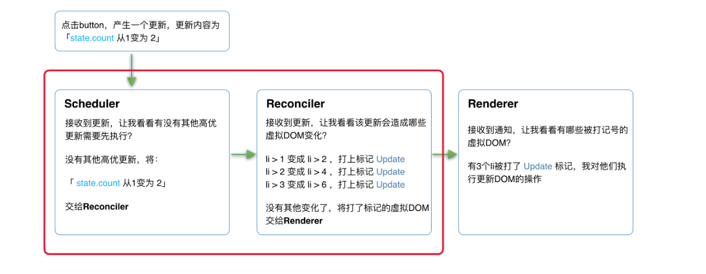

在 React16 中更新流程如上图，其中红框中的步骤随时可能由以下原因被中断：

- 有其他更高优先任务需要先更新。
- 当前帧没有剩余时间。

由于红框中的工作都在内存中进行，不会更新页面上的 DOM，所以即使反复中断，用户也不
会看见更新不完全的 DOM。

> 实际上，由于**Scheduler**和**Reconciler**都是平台无关的，所以 React 为他们单独
> 发了一个包[react-Reconciler](https://www.npmjs.com/package/react-reconciler)。
> 你可以用这个包自己实现一个 ReactDOM。

## Fiber 架构的心智模型

### 什么是代数效应

代数效应是函数式编程中的一个概念，用于将副作用从函数调用中分离。

### 代数效应在 react 中的应用

那么代数效应与 React 有什么关系呢？最明显的例子就是 Hooks。 对于类似
useState、useReducer、useRef 这样的 Hook，我们不需要关注 FunctionComponent 的
state 在 Hook 中是如何保存的，React 会为我们处理。 我们只需要假设 useState 返回
的是我们想要的 state，并编写业务逻辑就行。

### 代数效应与 Generator

协调器(Reconciler)重构的以达目的是：将老的同步更新的架构变为异步可中断更新。 异
步可中断更新可以理解为：更新在执行过程中可能会被打断（浏览器时间分片用尽或有更高
优先任务插队），当可以继续执行时恢复之前执行的中间状态。 其实，浏览器原生有支持
类似的实现，那就是 Generator。 但由于如下的缺陷，Generator 被 React 团队放弃了：

- 类似 async，await，Generator 也是有传染性的，使用了 Generator 则上下文的其他函
  数也需要做出改变。这样心智负担就比较重。
- Generator 执行的中间状态是上下文关联的。

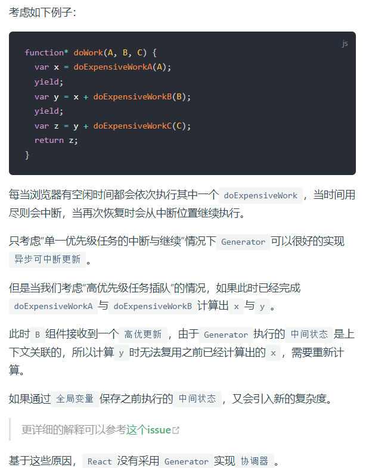

### 代数效应与 Fiber

Fiber 并不是计算机术语中的新名词，他的中文翻译叫做纤程，与进程（Process）、线程
（Thred）、协程（Coroutine）同为程序执行的过程。 在很多文章中将纤程理解为协程的
一种实现。在 JS 中，协程的实现便是 Generator。所以，我们可以将纤(Fiber)、协程
(Generator)理解为代数效应思想在 JS 中的体现。 React Fiber 可以理解为：React 内部
实现的一套状态更新机制。支持任务不同优先级，可中断与恢复，并且恢复后可以复用之前
的中间状态。其中每个任务更新单元为 React Element 对应的 Fiber 结点。

## Fiber 实现原理

### Fiber 的起源

> 最早的 Fiber 官方解释来源
> 于[2016 年 React 团队成员 Acdlite 的一篇介绍](https://github.com/acdlite/react-fiber-architecture)。

在 react15 以前，Reconciler 采用递归的方式创建虚拟 DOM，递归过程是不可中断的。如
果组件树的层级很深，递归会占用线程很多时间，造成卡顿。 为了解决这个问题，React16
将**递归的无法中断的更新**重构为**异步的可中断更新**，由于曾经用于递归的虚拟 DOM
数据结构已经无法满足需要。于是，全新的 Fiber 架构应运而生。

### Fiber 的含义

Fiber 有三层含义：

1. 作为架构来说，之前 React15 的 Reconciler 采用递归的方式执行，数据保存在递归调
   用栈中，所以被称为 stack Reconciler。React16 的 Reconciler 基于 Fiber 节点实
   现，被称为 Fiber Reconciler。
2. 作为静态的数据结构来说，每个 Fiber 节点对应一个 React element，保存了该组件的
   类型（函数组件/类组件/原生组件...）、对应的 DOM 系欸但等信息。
3. 作为动态的工作单元来说，每个 Fiber 节点保存了本次更新中该组件改变的状态、要执
   行的工作（需要被删除/被插入页面中/被更新...）。

### Fiber 的结构

我们可以
在[React 源码中](https://github.com/facebook/react/blob/1fb18e22ae66fdb1dc127347e169e73948778e5a/packages/react-reconciler/src/ReactFiber.new.js#L117)看
到 Fiber 的定义。虽然属性很多，但我们可以按三层含义来将他们分类来看。

```JavaScript
function FiberNode(
  tag: WorkTag,
  pendingProps: mixed,
  key: null | string,
  mode: TypeOfMode,
) {
  // 作为静态数据结构的属性
  this.tag = tag;
  this.key = key;
  this.elementType = null;
  this.type = null;
  this.stateNode = null;

  // 用于连接其他Fiber节点形成Fiber树
  this.return = null;
  this.child = null;
  this.sibling = null;
  this.index = 0;

  this.ref = null;

  // 作为动态的工作单元的属性
  this.pendingProps = pendingProps;
  this.memoizedProps = null;
  this.updateQueue = null;
  this.memoizedState = null;
  this.dependencies = null;

  this.mode = mode;

  this.effectTag = NoEffect;
  this.nextEffect = null;

  this.firstEffect = null;
  this.lastEffect = null;

  // 调度优先级相关
  this.lanes = NoLanes;
  this.childLanes = NoLanes;

  // 指向该fiber在另一次更新时对应的fiber
  this.alternate = null;
}
```

#### 作为架构来说

每个 Fiber 节点有个对应的 React element，多个 Fiber 节点依靠下面三个属性连接形成
树：

```JavaScript
// 指向父级Fiber节点
this.return = null;
// 指向子Fiber节点
this.child = null;
// 指向右边第一个兄弟Fiber节点
this.sibling = null;
```

以下面的代码为例：

```JavaScript
function App() {
  return (
    <div>
      i am
      <span>KaSong</span>
    </div>
  )
}
```

其对应的 fiber 树结构如下：

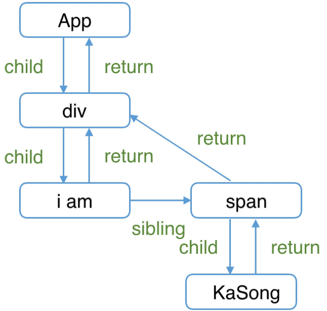

> 这里需要提一下，为什么父级指针叫做 return 而不是 parent 或者 father 呢？因为作
> 为一个工作单元，return 指节点执行完 completeWork（本章后面会介绍）后会返回的下
> 一个节点。子 Fiber 节点及其兄弟节点完成工作后会返回其父级节点，所以用 return
> 指代父级节点。

#### 作为静态数据结构

作为一种静态的数据结构，保存了组件相关的信息：

```JavaScript
// Fiber对应组件的类型 Function/Class/Host...
this.tag = tag;
// key属性
this.key = key;
// 大部分情况同type，某些情况不同，比如FunctionComponent使用React.memo包裹
this.elementType = null;
// 对于 FunctionComponent，指函数本身，对于ClassComponent，指class，对于HostComponent，指DOM节点tagName
this.type = null;
// Fiber对应的真实DOM节点
this.stateNode = null;
```

#### 作为动态的工作单元

作为动态的工作单元，Fiber 中如下参数保存了本次更新相关的信息：

```JavaScript
// 保存本次更新造成的状态改变相关信息
this.pendingProps = pendingProps;
this.memoizedProps = null;
this.updateQueue = null;
this.memoizedState = null;
this.dependencies = null;

this.mode = mode;

// 保存本次更新会造成的DOM操作
this.effectTag = NoEffect;
this.nextEffect = null;

this.firstEffect = null;
this.lastEffect = null;

// 调度优先级相关
this.lanes = NoLanes;
this.childLanes = NoLanes;
```

## Fiber 工作原理

这里主要讨论 Fiber 如何更新 DOM，主要用到了被称为“双缓存”的技术。

### 什么是“双缓存”

当我们用 canvas 绘制动画，每一帧绘制前都会调用 ctx.clearRect 清除上一帧的画面。
如果当前帧画面计算量比较大，导致清除上一帧画面到绘制当前帧画面之间有较长间隙，就
会出现白屏。为了解决这个问题，我们可以在内存中绘制当前帧动画，绘制完毕后直接用当
前帧替换上一帧画面，由于省去了两帧替换间的计算时间，不会出现从白屏到出现画面的闪
烁情况。这种**在内存中构建并直接替换**的技术叫
做[双缓存](https://baike.baidu.com/item/双缓冲)。 React 使用“双缓存”来完成 Fiber
树的构建与替换——对应着 DOM 树的创建与更新。

### 双缓存 Fiber 树

在 React 中最多会同时存在两棵 Fiber 树。当前屏幕上显示内容对应的 Fiber 树称为
current Fiber 树，正在内存中构建的 Fiber 树称为 workInProgress Fiber 树。
current Fiber 树中的 Fiber 节点被称为 current fiber，workInProgress Fiber 树中的
Fiber 节点被称为 workInProgress fiber，他们通过 alternate 属性连接。

```JavaScript
currentFiber.alternate === workInProgressFiber;
workInProgressFiber.alternate === currentFiber;
```

React 应用的根节点通过使 current 指针在不同 Fiber 树的 rootFiber 间切换来完成
current Fiber 树指向的切换。 即当 workInProgress Fiber 树构建完成交给 Renderer
渲染在页面上后，应用根节点的 current 指针指向 workInProgress Fiber 树，此时
workInProgress Fiber 树就变为 current Fiber 树。 每次状态更新都会产生新的
workInProgress Fiber 树，通过 current 与 workInProgress 的替换，完成 DOM 更新。
接下来我们以具体例子讲解 mount 时、update 时的构建/替换流程。

### mount 时

举例：

```JavaScript
function App() {
  const [num, add] = useState(0);
  return (
    <p onClick={() => add(num + 1)}>{num}</p>
  )
}

ReactDOM.render(<App/>, document.getElementById('root'));
```

1. 首次执行 ReactDOM.render 会创建 fiberRootNode（源码中叫 fiberRoot）和
   rootFiber。其中 fiberRootNode 是整个应用的根节点，rootFiber 是所在组件树的根
   节点。之所以要区分 fiberRootNode 与 rootFiber，是因为在应用中我们可以多次调用
   ReactDOM.render 渲染不同的组件树，他们会拥有不同的 rootFiber。但是整个应用的
   根节点只有一个，那就是 fiberRootNode。fiberRootNode 的 current 会指向当前页面
   上已渲染内容对应 Fiber 树，即 current Fiber 树。

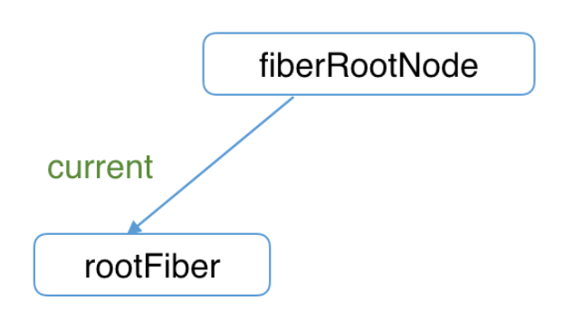

```JavaScript
fiberRootNode.current = rootFiber;
```

由于是首屏渲染，页面中还没有挂载任何 DOM，所以 fiberRootNode.current 指向的
rootFiber 没有任何子 Fiber 节点（即 current Fiber 树为空）。

1. 接下来进入 render 阶段，根据组件返回的 JSX 在内存中依次创建 Fiber 节点并连接
   在一起构建 Fiber 树，被称为 workInProgress Fiber 树。（下图中右侧为内存中构建
   的树，左侧为页面显示的树）。在构建 workInProgress Fiber 树时会尝试复用
   current Fiber 树中已有的 Fiber 节点内的属性，在首屏渲染时只有 rootFiber 存在
   对应的 current fiber（即 rootFiber.alternate）。

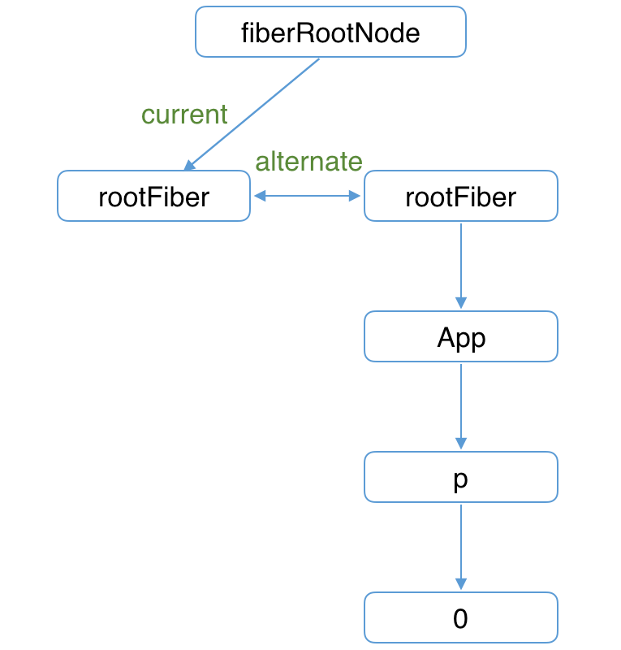

1. 图中右侧已构建完的 workInProgress Fiber 树在 commit 阶段渲染到页面。此时 DOM
   更新为右侧树对应的样子。fiberRootNode 的 current 指针指向 workInProgress
   Fiber 树使其变为 current Fiber 树。

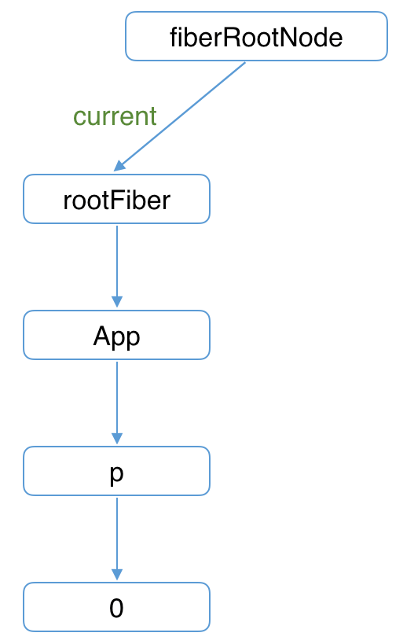

### update 时

1. 接下来我们点击 p 节点触发状态改变，这会开启一次新的 render 阶段并构建一棵新的
   workInProgress Fiber 树。

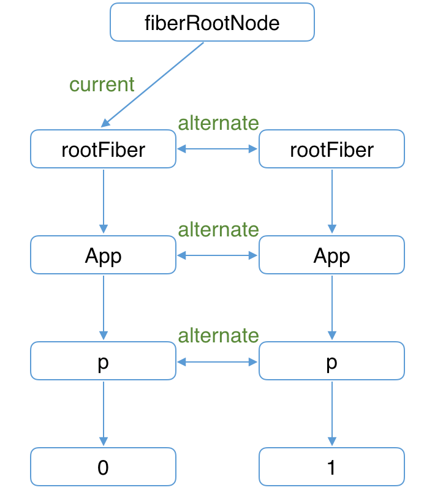

和 mount 时一样，workInProgress fiber 的创建可以复用 current Fiber 树对应的节点
数据。

1. workInProgress Fiber 树在 render 阶段完成构建后进入 commit 阶段渲染到页面上。
   渲染完毕后，workInProgress Fiber 树变为 current Fiber 树。

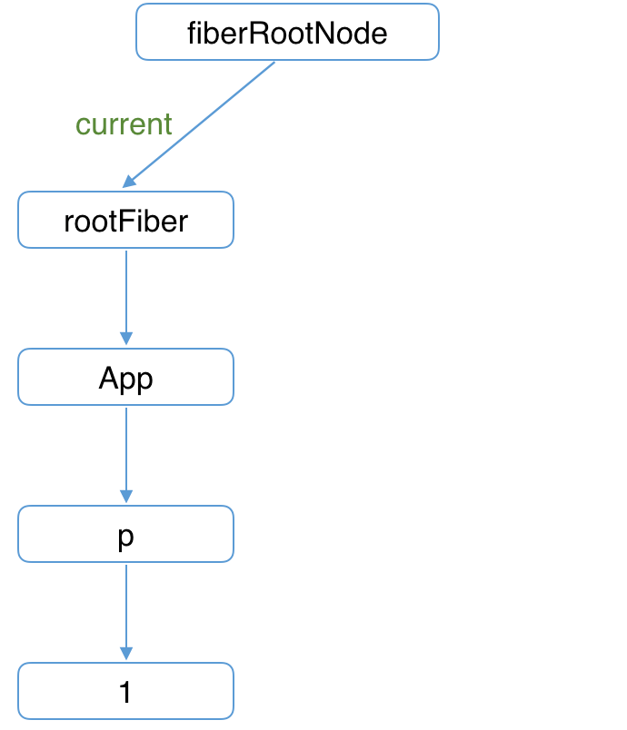

# 前置知识

## 如何调试源码

react 调试源码遵循一下步骤：

1. 从 facebook/react 项目 master 分支拉取最新源码。
2. 基于最新源码构建 react、scheduler、react-dom 三个包。
3. 通过 creat-react-app 创建测试项目，并使用步骤 2 创建的包作为项目依赖的包。

### 拉取源码

拉取 facebook/react 代码

```Bash
# 拉取代码
git clone https://github.com/facebook/react.git

# 如果拉取速度很慢，可以考虑如下2个方案：

# 1. 使用cnpm代理
git clone https://github.com.cnpmjs.org/facebook/react

# 2. 使用码云的镜像（一天会与react同步一次）
git clone https://gitee.com/mirrors/react.git
```

安装依赖

```Bash
# 切入到react源码所在文件夹
cd react

# 安装依赖
yarn
```

打包 react、scheduler、react-dom 三个包为 dev 环境可以使用 cjs 包。

```Bash
# 执行打包命令
yarn build react/index,react/jsx,react-dom/index,scheduler --type=NODE
# 如果yarn打包失败，请更换npm
npm run build react/index,react/jsx,react-dom/index,scheduler --type=NODE
```

现在源码目录 build/node_modules 下会生成最新代码的包。我们为 react、react-dom 创
建 yarn link。

> 通过 yarn link 可以改变项目中依赖包的目录指向

```Bash
cd build/node_modules/react
# 申明react指向
yarn link
cd build/node_modules/react-dom
# 申明react-dom指向
yarn link
```

### 创建项目

接下来我们通过 creat-react-app 在其他地方创建新项目。

```Bash
npx create-react-app a-react-demo
```

在新项目中，将 react 与 react-dom2 个包指向 facebook/react 下我们刚才生成的包。

```Bash
# 将项目内的react react-dom指向之前申明的包
yarn link react react-dom
```

现在试试在 react/build/node_modules/react-dom/cjs/react-dom.development.js 中随
意打印些东西。在 a-react-demo 项目下执行 yarn start。现在浏览器控制台已经可以打
印出我们输入的东西了。通过以上方法，我们的运行时代码就和 React 最新代码一致了。

## 源码的目录结构

### 顶层目录

除去配置文件和隐藏文件夹，根目录的文件夹包括三个：

```Bash
根目录
├── fixtures        # 包含一些给贡献者准备的小型 React 测试项目
├── packages        # 包含元数据（比如 package.json）和 React 仓库中所有 package 的源码（子目录 src）
├── scripts         # 各种工具链的脚本，比如git、jest、eslint等
```

这里我们关注 packages 目录

### packages 目录

目录下的文件非常多，我们来看下：

#### react 文件夹

React 的核心，包含所有全局 React API，如：

- React.createElement
- React.Component
- React.Children

这些 API 时全平台通用的，它不包含 ReactDOM，ReactNative 等平台的代码。在 npm 平
台上作为一个单独的包发布。

#### scheduler 文件夹

Scheduler（调度器）的实现。

#### shared 文件夹

源码中其他模块公用的方法和全局变量，比如
在[shared/ReactSymbols.js](https://github.com/facebook/react/blob/1fb18e22ae66fdb1dc127347e169e73948778e5a/packages/shared/ReactSymbols.js)中
保存 React 不同组件类型的定义。

#### Renderer 相关的文件夹

如下几个文件夹为对应的 Renderer

```Bash
- react-art
- react-dom                 # 注意这同时是DOM和SSR（服务端渲染）的入口
- react-native-renderer
- react-noop-renderer       # 用于debug fiber（后面会介绍fiber）
- react-test-renderer
```

#### 实验性包的文件夹

React 将自己流程中的一部分抽离出来，形成可以独立使用的包，由于他们是试验性质的，
所以不被建议在生产环境使用。包括如下文件夹：

```Bash
- react-server        # 创建自定义SSR流
- react-client        # 创建自定义的流
- react-fetch         # 用于数据请求
- react-interactions  # 用于测试交互相关的内部特性，比如React的事件模型
- react-reconciler    # Reconciler的实现，你可以用他构建自己的Renderer
```

#### 辅助包的文件夹

React 将一些辅助功能形成单独的包。包括如下文件夹：

```Bash
- react-is       # 用于测试组件是否是某类型
- react-client   # 创建自定义的流
- react-fetch    # 用于数据请求
- react-refresh  # “热重载”的React官方实现
```

### react-reconciler 文件夹

我们需要重点关注的文件夹，虽然他是一个实验性质的包，内部的很多功能在正式版中还未
开放。但他一边对接`Scheduler`，一边对接不同平台的 Renderer，构成了 React16 的架
构体系。

## 深入理解 JSX

JSX 作为描述组件内容的数据结构，为 js 赋予了更多视觉表现力。在 React 中我们大量
使用他。在深入源码之前，有些疑问我们需要先解决：

- JSX 和 Fiber 节点是同一个东西吗？
- `React Component`、`React Element`是同一个东西吗，他们和 JSX 有什么关系？

### JSX 简介

关于什么是 JSX
请[点击这里](https://react.docschina.org/docs/introducing-jsx.html)去官网查看
。JSX 在编译时会被 Babel 编译为`React.createElement`方法。但是 JSX 并不是只能编
译为`React.createElement`方法，我们可以通
过[babel-plugin-transform-react-jsx](https://babeljs.io/docs/en/babel-plugin-transform-react-jsx)插
件显式告诉 Babel 编译时需要将 JSX 编译为什么函数的调用。

### React.createElement

[点击这里](https://github.com/facebook/react/blob/1fb18e22ae66fdb1dc127347e169e73948778e5a/packages/react/src/ReactElement.js#L348)查
看源码。 既然 JSX 会编译为`React.createElement`，让我们看看他做了什么：

```JavaScript
export function createElement(type, config, children) {
  let propName;

  const props = {};

  let key = null;
  let ref = null;
  let self = null;
  let source = null;

  if (config != null) {
    // 将 config 处理后赋值给 props
    // ...省略
  }

  const childrenLength = arguments.length - 2;
  // 处理 children，会被赋值给props.children
  // ...省略

  // 处理 defaultProps
  // ...省略

  return ReactElement(
    type,
    key,
    ref,
    self,
    source,
    ReactCurrentOwner.current,
    props,
  );
}

const ReactElement = function(type, key, ref, self, source, owner, props) {
  const element = {
    // 标记这是个 React Element
    $$typeof: REACT_ELEMENT_TYPE,

    type: type,
    key: key,
    ref: ref,
    props: props,
    _owner: owner,
  };

  return element;
};
```

我们可以看到，`React.createElement`最终会调用`ReactElement`方法返回一个包含组件
数据的对象，该对象有个参数`$$typeof: REACT_ELEMENT_TYPE`，标记了该对象是
个`React Element`。 React 提供了验证合法`React Element`的全局
API[React.isValidElement](https://github.com/facebook/react/blob/1fb18e22ae66fdb1dc127347e169e73948778e5a/packages/react/src/ReactElement.js#L547)。

```JavaScript
export function isValidElement(object) {
  return (
    typeof object === 'object' &&
    object !== null &&
    object.$$typeof === REACT_ELEMENT_TYPE
  );
}
```

可以看到，`$$typeof === REACT_ELEMENT_TYPE`的非`null`对象就是一个合法
的`React Element`。换言之，在 React 中，所有 JSX 运行时的返回结果（
即`React.createElement()`的返回值）都是`React Element`。 那么 JSX
和`React Component`又有什么关系呢？

### React Component

在 React 中，我们常用`ClassComponent`和`FunctionComponent`构建组件。

```JavaScript
class AppClass extends React.Component {
  render() {
    return <p>KaSong</p>
  }
}
console.log('这是ClassComponent：', AppClass);
console.log('这是Element：', <AppClass/>);


function AppFunc() {
  return <p>KaSong</p>;
}
console.log('这是FunctionComponent：', AppFunc);
console.log('这是Element：', <AppFunc/>);
```

这里 consloe 输出了两个 component 的对象，`ClassComponent`对应
的`Element`的`type`字段为`AppClass`自身。`FunctionComponent`对应
的`Element`的`type`字段为`AppFunc`自身，如下所示：

```JavaScript
{
  $$typeof: Symbol(react.element),
  key: null,
  props: {},
  ref: null,
  type: ƒ AppFunc(),
  _owner: null,
  _store: {validated: false},
  _self: null,
  _source: null
}
```

需要注意的是,由于

```JavaScript
AppClass instanceof Function === true;
AppFunc instanceof Function === true;
```

所以我们无法通过引用类型区分`ClassComponent`和`FunctionComponent`。react 通
过`ClassComponent`实力原型上的`isReactComponent`变量来判断是否
是`ClassComponent`。

### JSX 与 Fiber 节点

JSX 是一种描述当前组件内容的数据结构，它不包含组
件**schedule、reconcile、render**所需的相关信息。比如以下信息就不包括在 JSX 中：

- 组件在更新中的优先级
- 组件的 state
- 组件被打上的用于 Renderer 的标记

所以，在组建`mount`时，`Reconciler`根据 JSX 描述的组件内容生成组件对应的 Fiber
节点。 在`undate`时，`Reconciler`将 JSX 与 Fiber 节点保存的数据对比，生成嘴贱对
应的 Fiber 节点，并根据对比结果为 Fiber 节点打上标记。

# React 的 Render 阶段

## 流程概览

这一段我们介绍 Fiber 节点是如何被创建并构建 Fiber 树的。 `render`阶段开始
于`performSyncWorkOnRoot`或`performConcurrentWorkOnRoot`方法的调用。这取决于本次
更新是同步更新还是异步更新。

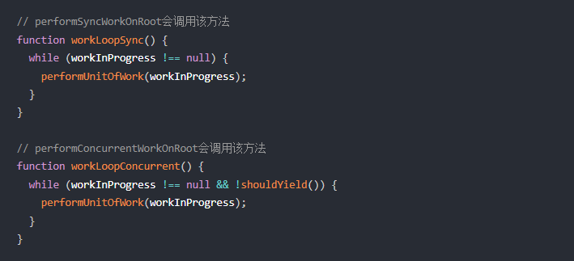

我们可以看到，他们唯一的区别是是否调用`shouldYield`。如果当前浏览器帧没有剩余时
间，`shouldYield`会中止循环，直到浏览器有空闲时间后再继续遍历。
`workInProgress`代表当前已创建的`workInProgress fiber`。 `performUnitOfWork`方法
会创建下一个 Fiber 节点并赋值给`workInProgress`，并将`workInProgress`与已创建的
Fiber 节点连接起来构成 Fiber 树。 我们知道`Fiber Reconciler`是
从`Stack Reconciler`重构而来，通过遍历的方式实现可中断的递归，所
以`performUnitOfWork`的工作可以分为两部分：“递”和“归”

## “递”阶段

首先葱 rootFiber 开始向下深度优先遍历。为遍历到的每个 Fiber 节点调
用[beginWork](https://github.com/facebook/react/blob/970fa122d8188bafa600e9b5214833487fbf1092/packages/react-reconciler/src/ReactFiberBeginWork.new.js#L3058)方
法。 该方法会根据传入的 Fiber 节点创建子 Fiber 节点，并将这两个 Fiber 节点连接起
来。 当遍历到叶子节点（即没有子组件的组件）就会进入“归”阶段。

## “归”阶段

在“归”阶段会调
用[completeWork](https://github.com/facebook/react/blob/970fa122d8188bafa600e9b5214833487fbf1092/packages/react-reconciler/src/ReactFiberCompleteWork.new.js#L652)处
理 Fiber 节点。 当某个 fiber 节点执行完`completeWork`，如果其存在兄弟 Fiber 节点
（即 fiber.sibling !== null），会进入其兄弟 Fiber 的“递”阶段。 "递"和“归”阶段会
交错执行知道“归”到 rootFiber。至此，render 阶段的工作就结束了。

## 例子

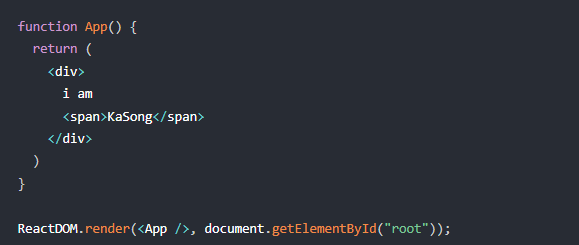

对应的 Fiber 树结构：

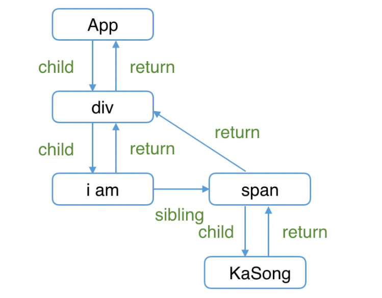

render 阶段会依次执行：

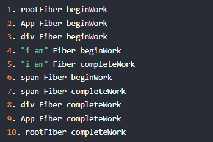

:::danger 注意： 之所以没有“KaSong” Fiber 的 `beginWork/completeWork`，是因为作
为一种性能优化手段，针对只有单一文本子节点的 Fiber，React 会特殊处理。 :::

## beginWork

可以从这里看
到[beginWork 的定义](https://github.com/facebook/react/blob/1fb18e22ae66fdb1dc127347e169e73948778e5a/packages/react-reconciler/src/ReactFiberBeginWork.new.js#L3075)，`beginWork`的
工作是传入`当前fiber节点`，创建`子Fiber节点`，我们从传参来看看具体是如何做的。

### 从传参看方法执行

```JavaScript
function beginWork(
  current: Fiber | null,
  workInProgress: Fiber,
  renderLanes: Lanes,
): Fiber | null {
  // ...省略函数体
}
```

其中：

- current：当前嘴贱对应的`Fiber节点`在上一次更新时的`Fiber节点`，
  即`workInProgress.alternate`
- workInProgress：当前组件对应的`Fiber节点`
- renderLanes：优先级相关

根据`双缓存机制`除`rootFiber`以外，组件`mount`时，由于是首次渲染，是不存在当前组
件对应的`Fiber节点`在上一次更新时的`Fiber节点`，即`mount`时`current===null`。 组
件`update`时，由于之前已经`mount`过，所以`current !== null`。 所以我们可以通
过`current === null ?`来区分组件是出于`mount`还是`update`。 基于此原因
，`beginWork`的工作可以分为两部分：

- `update`时：如果`current`存在，在满足一定条件时可以复用`current`节点，这样就能
  克隆`current.child`作为`workInprogress.child`，而不需要新
  建`workInProgress.child`。
- `mount`时：除`fiberRootNode`以外，`current === null`。会根据`fiber.tag`不同，
  创建不同类型的`子Fiber节点`。

```JavaScript
function beginWork(
  current: Fiber | null,
  workInProgress: Fiber,
  renderLanes: Lanes
): Fiber | null {

  // update时：如果current存在可能存在优化路径，可以复用current（即上一次更新的Fiber节点）
  if (current !== null) {
    // ...省略

    // 复用current
    return bailoutOnAlreadyFinishedWork(
      current,
      workInProgress,
      renderLanes,
    );
  } else {
    didReceiveUpdate = false;
  }

  // mount时：根据tag不同，创建不同的子Fiber节点
  switch (workInProgress.tag) {
    case IndeterminateComponent:
      // ...省略
    case LazyComponent:
      // ...省略
    case FunctionComponent:
      // ...省略
    case ClassComponent:
      // ...省略
    case HostRoot:
      // ...省略
    case HostComponent:
      // ...省略
    case HostText:
      // ...省略
    // ...省略其他类型
  }
}
```

### update 时

当满足一下情况时`didReceiveUpdate === false`（即可以直接复用前一次更新
的`子Fiber`，不需要新建`子Fiber`)

1. `oldProps === newProps && workInProgress.type === current.type`，
   即`props`与`fiber.type`不变
2. `!includesSomeLane(renderLanes, updateLanes)`，即当前`Fiber节点`优先级不够。

```JavaScript
if (current !== null) {
    const oldProps = current.memoizedProps;
    const newProps = workInProgress.pendingProps;

    if (
      oldProps !== newProps ||
      hasLegacyContextChanged() ||
      (__DEV__ ? workInProgress.type !== current.type : false)
    ) {
      didReceiveUpdate = true;
    } else if (!includesSomeLane(renderLanes, updateLanes)) {
      didReceiveUpdate = false;
      switch (workInProgress.tag) {
        // 省略处理
      }
      return bailoutOnAlreadyFinishedWork(
        current,
        workInProgress,
        renderLanes,
      );
    } else {
      didReceiveUpdate = false;
    }
  } else {
    didReceiveUpdate = false;
  }
```

### mount 时

当不满足优化路径时，我们进入第二部分，新建`子Fiber`。 我们可以看到，根
据`fiber.tag`不同，进入不同类型`Fiber`的创建逻辑。

> 可以
> 从[这里](https://github.com/facebook/react/blob/1fb18e22ae66fdb1dc127347e169e73948778e5a/packages/react-reconciler/src/ReactWorkTags.js)看
> 到`tag对应的组件类型`

```JavaScript
// mount时：根据tag不同，创建不同的Fiber节点
switch (workInProgress.tag) {
  case IndeterminateComponent:
    // ...省略
  case LazyComponent:
    // ...省略
  case FunctionComponent:
    // ...省略
  case ClassComponent:
    // ...省略
  case HostRoot:
    // ...省略
  case HostComponent:
    // ...省略
  case HostText:
    // ...省略
  // ...省略其他类型
}
```

对于我们常见的组件类型，如
（`FunctionComponent`/`ClassComponent`/`HostComponent`），最终会进
入[reconcileChildren](https://github.com/facebook/react/blob/1fb18e22ae66fdb1dc127347e169e73948778e5a/packages/react-reconciler/src/ReactFiberBeginWork.new.js#L233)。

### reconcileChildren

从该函数名就可以看出这是`Reconciler`模块的核心部分。那它究竟做了什么呢？

- 对于`mount`的组件，他会创建新的`子Fiber节点`
- 对于`update`的组件，它会将当前组件与该组件在上次更新时对应的`Fiber节点`比较（
  也就是俗称的`Diff`算法），将比较的结果生成新`Fiber节点`

```JavaScript
export function reconcileChildren(
  current: Fiber | null,
  workInProgress: Fiber,
  nextChildren: any,
  renderLanes: Lanes
) {
  if (current === null) {
    // 对于mount的组件
    workInProgress.child = mountChildFibers(
      workInProgress,
      null,
      nextChildren,
      renderLanes,
    );
  } else {
    // 对于update的组件
    workInProgress.child = reconcileChildFibers(
      workInProgress,
      current.child,
      nextChildren,
      renderLanes,
    );
  }
}
```

从代码可以看出，和`beginWork`一样，他也是通过`current === null ?`区
分`mount`与`update`。 不论走哪个逻辑，最终他会生成新的子`fiber节点`并赋值
给`workProggress.child`，作为本
次`beginWork`[返回值](https://github.com/facebook/react/blob/1fb18e22ae66fdb1dc127347e169e73948778e5a/packages/react-reconciler/src/ReactFiberBeginWork.new.js#L1158)，
并作为下次`performUnitOfWork`执行
时`workInProgress`的[传参](https://github.com/facebook/react/blob/1fb18e22ae66fdb1dc127347e169e73948778e5a/packages/react-reconciler/src/ReactFiberWorkLoop.new.js#L1702)。
:::info 值得一提的是，`mountChildFibers`与`reconcileChildFibers`这两个方法的逻辑
基本一致。唯一的区别是：`reconcileChildFibers`会为生成的`Fiber节点`带
上`effectTag`属性，而`mountChildFibers`不会。 :::

### effectTag

我们知道，`render阶段`的工作是在内存中进行，当工作结束后会通知`Renderer`需要执行
的`DOM`操作。要执行`DOM`操作的具体类型就保存在`fiber.effectTag`中。

> 可以
> 从[这里](https://github.com/facebook/react/blob/1fb18e22ae66fdb1dc127347e169e73948778e5a/packages/react-reconciler/src/ReactSideEffectTags.js)看
> 到 effectTag 对应的`DOM`操作

比如：

```JavaScript
// DOM需要插入到页面中
export const Placement = /*                */ 0b00000000000010;
// DOM需要更新
export const Update = /*                   */ 0b00000000000100;
// DOM需要插入到页面中并更新
export const PlacementAndUpdate = /*       */ 0b00000000000110;
// DOM需要删除
export const Deletion = /*                 */ 0b00000000001000;
```

> 通过二进制表示`effectTag`，可以方便的使用位操作为`fiber.effectTag`赋值多
> 个`effect`。

那么，如果要通知`Renderer`将`Fiber节点`对应的`DOM节点`插入页面中，需要满足两个条
件：

1. `fiber.stateNode`存在，即`Fiber节点`中保存了对应的`DOM节点`
2. `(fiber.effectTag & Placement) !== 0`，即`Fiber节点`存在`Placement effectTag`

我们知道，`mount`时，`fiber.stateNode === null`，且在`reconcilChildren`中调用
的`mountChildFibers`不会为`Fiber节点`赋值`effectTag`。那么首屏渲染如何完成呢？针
对第一个问题，`fiber.stateNode`会在`completeWork中创建。` 第二个问题的答案十分巧
妙：假设`mountChildFibers`也会赋值`effectTag`，那么可以预见`mount`时整
棵`Fiber树`所有节点都会有`Placement effectTag`。那么`commit阶段`在执行`DOM`操作
时每个节点都会执行一次插入操作，这样大量的`DOM`操作是极低效的。为了解决这个问题
，在`mount`时只有`rootFiber`会赋值`Placement effectTag`，在`commit阶段`只会执行
一次插入操作。

### beginWork 流程图


## completeWork

### 流程概览

类似`beginWork`，`completeWork`也是针对不同`fiber.tag`调用不同的处理逻辑。

```JavaScript
function completeWork(
  current: Fiber | null,
  workInProgress: Fiber,
  renderLanes: Lanes,
): Fiber | null {
  const newProps = workInProgress.pendingProps;

  switch (workInProgress.tag) {
    case IndeterminateComponent:
    case LazyComponent:
    case SimpleMemoComponent:
    case FunctionComponent:
    case ForwardRef:
    case Fragment:
    case Mode:
    case Profiler:
    case ContextConsumer:
    case MemoComponent:
      return null;
    case ClassComponent: {
      // ...省略
      return null;
    }
    case HostRoot: {
      // ...省略
      updateHostContainer(workInProgress);
      return null;
    }
    case HostComponent: {
      // ...省略
      return null;
    }
  // ...省略
```

我们充电关注页面渲染所必须的`HostComponent`（即原生`DOM组件`对应的`Fiber节点`）
。

### 处理 HostComponent

和`beginWork`一样，我们根据`current === null ?`判断是`mount`还是`update`。 同时
针对`HostComponent`,判断`update`时我们还需要考
虑`workInProgress.stateNode != null ?`（即该`Fiber节点`是否存在对应的`DOM节点`）

```JavaScript
case HostComponent: {
  popHostContext(workInProgress);
  const rootContainerInstance = getRootHostContainer();
  const type = workInProgress.type;

  if (current !== null && workInProgress.stateNode != null) {
    // update的情况
    // ...省略
  } else {
    // mount的情况
    // ...省略
  }
  return null;
}
```

### update 时

当`update`时，`Fiber节点`已经存在对应`DOM节点`，所以不需要生成`DOM节点`。需要做
的主要是处理`props`，比如：

- `onClick`、`onChange`等回调函数的注册
- 处理`style prop`
- 处理`DANGEROUSLY_SET_INNER_HTML prop`
- 处理`children prop`

我们可以看到其主要逻辑是调
用[updateHostComponent](https://github.com/facebook/react/blob/1fb18e22ae66fdb1dc127347e169e73948778e5a/packages/react-reconciler/src/ReactFiberCompleteWork.new.js#L225)方
法。

```JavaScript
if (current !== null && workInProgress.stateNode != null) {
  // update的情况
  updateHostComponent(
    current,
    workInProgress,
    type,
    newProps,
    rootContainerInstance,
  );
}
```

在`HostComponent`内部，被处理完的`props`会被赋值给`workInProgress.Progress`，并
最终会在`commit阶段`被渲染在页面上。

```JavaScript
workInProgress.updateQueue = (updatePayload: any);
```

其中`updatePayload`为数组形式，他的偶数索引为变化的`prop key`，奇数索引的值为变
化的`prop value`。

### mount 时

同样，我们省略了不相关的逻辑。可以看到，`mount`时主要逻辑包括三个：

- 为`Fiber节点`生成对应的`DOM节点`
- 将子孙`DOM节点`插入刚生成的`DOM节点`中
- 与`update`逻辑中的`updateHostComponent`类似的处理`props`的过程

```JavaScript
// mount的情况

// ...省略服务端渲染相关逻辑

const currentHostContext = getHostContext();
// 为fiber创建对应DOM节点
const instance = createInstance(
    type,
    newProps,
    rootContainerInstance,
    currentHostContext,
    workInProgress,
  );
// 将子孙DOM节点插入刚生成的DOM节点中
appendAllChildren(instance, workInProgress, false, false);
// DOM节点赋值给fiber.stateNode
workInProgress.stateNode = instance;

// 与update逻辑中的updateHostComponent类似的处理props的过程
if (
  finalizeInitialChildren(
    instance,
    type,
    newProps,
    rootContainerInstance,
    currentHostContext,
  )
) {
  markUpdate(workInProgress);
}
```

还记得上一节我们讲到：`mount`时只会在`rootFiber`存在`Placement effectTag`。那
么`commit`阶段是如何通过一次插入 DOM 操作（对应一个`Placement effectTag`）将整棵
DOM 树插入页面的呢？ 原因就在于`completeWork`中的`appendAllChildren`方法。 由
于`completeWork`属于“归”阶段调用的函数，每次调用`appendAllChildren`时都会将已生
成的子孙 DOM 节点插入当前生成的`DOM节点`下。那么当“归”到`rootFiber`时，我们已经
有一个构建好的离屏`DOM树`。

### effectList

至此`render`阶段的绝大部分工作就完成了。 还有一个问题：作为`DOM`操作的依据
，`commit`阶段需要找到所有有`effectTag`的`Fiber节点`并依次执行`effectTag`对应操
作。难道需要在`commit`阶段再遍历一次`Fiber`树寻找`effectTag !== null`的 Fiber 节
点么？ 这显然是很低效的。 为了解决这个问题，在`completeWork`的上层函
数`completeUnitOfWork`中，每个执行完`completeWork`且存
在`effectTag`的`Fiber节点`会被保存在一条被称为`effectList`的单向链表中。
`effectList`中第一个`Fiber节点`保存在`fiber.firstEffect`，最后一个元素保存
在`fiber.lastEffect`。 类似`appendAllChildren`，在“归”阶段，所有
有`effectTag`的`Fiber节点`都会被追加在`effectList`中，最终形成一条
以`rootFiber.firstEffect`为起点的单向链表。

```Plaintext
                      nextEffect         nextEffect
rootFiber.firstEffect -----------> fiber -----------> fiber
```

这样，在`commit`阶段只需要遍历`effectList`就能执行所有`effect`了。 你可以
在[这里](https://github.com/facebook/react/blob/1fb18e22ae66fdb1dc127347e169e73948778e5a/packages/react-reconciler/src/ReactFiberWorkLoop.new.js#L1744)看
到这段代码逻辑。 借用 React 团队成员**Dan Abramov**的话：`effectList`相较
于`Fiber树`，就像圣诞树上挂的那一串彩灯。

### 流程结尾

至此，`render阶段`全部工作完成。在`performSyncWorkOnRoot`函数`fiberRootNode`被传
递给`commitRoot`方法，开启`commit阶段`。 代码
见[这里](https://github.com/facebook/react/blob/1fb18e22ae66fdb1dc127347e169e73948778e5a/packages/react-reconciler/src/ReactFiberWorkLoop.new.js#L1107)

### completeWork 流程图


# React 的 commit 阶段

## 流程概览

之前我们了解到，`commitRoot`方法是`commit阶段`工作的起点。`fiberRootNode`会作为
传参。 在`rootFiber.firstEffect`上保存了一条需要执行`副作用`的单向链
表`effectList`，这些`Fiber节点`的`updateQueue`中保存了变化的`props`。 这
些`副作用`对应的`DOM操作`在`commit`阶段执行。 除此之外，一些生命周期钩子（比
如`commponentDidXXX`）、`hook`（比如`useEffect`）需要在`commit`阶段执行。
`commit`阶段的主要工作（即`Renderer`的工作流程）分为三部分：

- before mutation 阶段（执行`DOM`操作之前）
- mutation 阶段（执行`DOM`操作）
- layout 阶段（执行`DOM`操作后）

我们可以
从[这里](https://github.com/facebook/react/blob/1fb18e22ae66fdb1dc127347e169e73948778e5a/packages/react-reconciler/src/ReactFiberWorkLoop.new.js#L2001)看
到`commit`的完整代码 在`before mutation阶段`之前和`layout阶段`之后还有一些额外工
作，涉及到比如`useEffect`的触发、`优先级相关`的重置、`ref`的绑定/解绑。

### before mutation 之前

`commitRootImpl`方法中直到第一句`if(firstEffect !== null)`之前属
于`before mutation`之前。

```JavaScript
do {
    // 触发useEffect回调与其他同步任务。由于这些任务可能触发新的渲染，所以这里要一直遍历执行直到没有任务
    flushPassiveEffects();
  } while (rootWithPendingPassiveEffects !== null);

  // root指 fiberRootNode
  // root.finishedWork指当前应用的rootFiber
  const finishedWork = root.finishedWork;

  // 凡是变量名带lane的都是优先级相关
  const lanes = root.finishedLanes;
  if (finishedWork === null) {
    return null;
  }
  root.finishedWork = null;
  root.finishedLanes = NoLanes;

  // 重置Scheduler绑定的回调函数
  root.callbackNode = null;
  root.callbackId = NoLanes;

  let remainingLanes = mergeLanes(finishedWork.lanes, finishedWork.childLanes);
  // 重置优先级相关变量
  markRootFinished(root, remainingLanes);

  // 清除已完成的discrete updates，例如：用户鼠标点击触发的更新。
  if (rootsWithPendingDiscreteUpdates !== null) {
    if (
      !hasDiscreteLanes(remainingLanes) &&
      rootsWithPendingDiscreteUpdates.has(root)
    ) {
      rootsWithPendingDiscreteUpdates.delete(root);
    }
  }

  // 重置全局变量
  if (root === workInProgressRoot) {
    workInProgressRoot = null;
    workInProgress = null;
    workInProgressRootRenderLanes = NoLanes;
  } else {
  }

  // 将effectList赋值给firstEffect
  // 由于每个fiber的effectList只包含他的子孙节点
  // 所以根节点如果有effectTag则不会被包含进来
  // 所以这里将有effectTag的根节点插入到effectList尾部
  // 这样才能保证有effect的fiber都在effectList中
  let firstEffect;
  if (finishedWork.effectTag > PerformedWork) {
    if (finishedWork.lastEffect !== null) {
      finishedWork.lastEffect.nextEffect = finishedWork;
      firstEffect = finishedWork.firstEffect;
    } else {
      firstEffect = finishedWork;
    }
  } else {
    // 根节点没有effectTag
    firstEffect = finishedWork.firstEffect;
  }
```

可以看到，`before mutation`之前主要做一些变量赋值，状态重置的工作。 这一长串代码
我们只需要关注最后赋值的`firstEffect`，在`commit`的三个子阶段都会用到他。

### layout 之后

接下来我们来简单看下`layout`阶段执行完之后的代码：

```JavaScript
const rootDidHavePassiveEffects = rootDoesHavePassiveEffects;

// useEffect相关
if (rootDoesHavePassiveEffects) {
  rootDoesHavePassiveEffects = false;
  rootWithPendingPassiveEffects = root;
  pendingPassiveEffectsLanes = lanes;
  pendingPassiveEffectsRenderPriority = renderPriorityLevel;
} else {}

// 性能优化相关
if (remainingLanes !== NoLanes) {
  if (enableSchedulerTracing) {
    // ...
  }
} else {
  // ...
}

// 性能优化相关
if (enableSchedulerTracing) {
  if (!rootDidHavePassiveEffects) {
    // ...
  }
}

// ...检测无限循环的同步任务
if (remainingLanes === SyncLane) {
  // ...
}

// 在离开commitRoot函数前调用，触发一次新的调度，确保任何附加的任务被调度
ensureRootIsScheduled(root, now());

// ...处理未捕获错误及老版本遗留的边界问题


// 执行同步任务，这样同步任务不需要等到下次事件循环再执行
// 比如在 componentDidMount 中执行 setState 创建的更新会在这里被同步执行
// 或useLayoutEffect
flushSyncCallbackQueue();

return null;
```

可以点
击[这里](https://github.com/facebook/react/blob/1fb18e22ae66fdb1dc127347e169e73948778e5a/packages/react-reconciler/src/ReactFiberWorkLoop.new.js#L2195)看
到这串代码 主要包括三点内容：

1. `useEffect`相关处理
2. 性能追踪相关
3. 在`commit`阶段会触发一些生命周期钩子（如`commponentDidXXX`）和`hook`（
   如`useLayEffect`、`useEffect`）。

## before mutation 阶段

### 概览

`before mutation阶段`的代码很短，整个过程就是遍历`effectList`并调
用`commitBeforeMutationEffects`函数处理。点
击[这里](https://github.com/facebook/react/blob/1fb18e22ae66fdb1dc127347e169e73948778e5a/packages/react-reconciler/src/ReactFiberWorkLoop.new.js#L2104-L2127)可
以查看源码。

```JavaScript
// 保存之前的优先级，以同步优先级执行，执行完毕后恢复之前优先级
const previousLanePriority = getCurrentUpdateLanePriority();
setCurrentUpdateLanePriority(SyncLanePriority);

// 将当前上下文标记为CommitContext，作为commit阶段的标志
const prevExecutionContext = executionContext;
executionContext |= CommitContext;

// 处理focus状态
focusedInstanceHandle = prepareForCommit(root.containerInfo);
shouldFireAfterActiveInstanceBlur = false;

// beforeMutation阶段的主函数
commitBeforeMutationEffects(finishedWork);

focusedInstanceHandle = null;
```

我们重点关注`beforeMutation`阶段的主函数`commitBeforeMutationEffects`做了什么。

### commitBeforeMutationEffects

大体代码逻辑如下：

```JavaScript
function commitBeforeMutationEffects() {
  while (nextEffect !== null) {
    const current = nextEffect.alternate;

    if (!shouldFireAfterActiveInstanceBlur && focusedInstanceHandle !== null) {
      // ...focus blur相关
    }

    const effectTag = nextEffect.effectTag;

    // 调用getSnapshotBeforeUpdate
    if ((effectTag & Snapshot) !== NoEffect) {
      commitBeforeMutationEffectOnFiber(current, nextEffect);
    }

    // 调度useEffect
    if ((effectTag & Passive) !== NoEffect) {
      if (!rootDoesHavePassiveEffects) {
        rootDoesHavePassiveEffects = true;
        scheduleCallback(NormalSchedulerPriority, () => {
          flushPassiveEffects();
          return null;
        });
      }
    }
    nextEffect = nextEffect.nextEffect;
  }
}
```

整体可以分为三部分：

1. 处理`DOM节点`渲染/删除后的`autoFocus`、`blur`逻辑。
2. 调用`getSnapshotBeforeUpdate`生命周期钩子。
3. 调度`useEffect`。

我们讲解一下 2、3 两点。

### 调用 getSnapshotBeforeUpdate

`commitBeforeMutationEffectOnFiber`是`commitBeforeMutationLifeCycles`的别名。 在
该方法内会调用`getSnapshotBeforeUpdate`。

> 点
> 击[这里](https://github.com/facebook/react/blob/1fb18e22ae66fdb1dc127347e169e73948778e5a/packages/react-reconciler/src/ReactFiberCommitWork.old.js#L222)可
> 以查看这段逻辑

从`Rect`v16 开始，`commponentWillXXX`钩子增加了`UNSAFE_`前缀。 究其原因，是因
为`Stack Reconciler`重构为`Fiber Reconciler后`，`render阶段`的任务可能中断/重新
开始，对应的组件在`render阶段`的生命周期狗子（即`commponentWillXXX`）可能触发多
次。 这种行为和`React`v15 不一致，所以标记为`UNSAFE_`。

> 更详细的解释参照[这里](https://juejin.cn/post/6847902224287285255#comment)。

为此，`React`提供了代替的生命周期钩子`getSnapshotBeforeUpdate`。 我们可以看见
，`getSnapshotBeforeUpdate`是在`commit阶段`内的`before mutation阶段`调用的，由
于`commit阶段`是同步的，所以不会遇到多次调用的问题。

### 调度 useEffect

在这几行代码内，`scheduleCallback`方法有`Scheduler`模块提供，用于以某个优先级异
步调度一个回调函数。

```JavaScript
// 调度useEffect
if ((effectTag & Passive) !== NoEffect) {
  if (!rootDoesHavePassiveEffects) {
    rootDoesHavePassiveEffects = true;
    scheduleCallback(NormalSchedulerPriority, () => {
      // 触发useEffect
      flushPassiveEffects();
      return null;
    });
  }
}
```

在此处，被异步调度的回调函数就是触发`useEffect`的方法`flushPassiveEffects`。 我
们接下来讨论`useEffect`如何被异步调度，以及为什么要异步（而不是同步）调度。

### 如何异步调度

在`flushPassiveEffects`方法内部会从全局变量`rootWithPendingPassiveEffects`获
取`effectList`。 `effectList`中保存了需要执行副作用的`Fiber节点`。其中副作用包括

- 插入`DOM节点`(Placement)
- 更新`DOM节点`(Update)
- 删除`DOM节点`(Deletion)

除此外，当一个`FunctionComponent`含有`useEffect`或`useLayoutEffect`，他对应
的`Fiber节点`也会被赋值`effectTag`。

> 我们可以
> 从[这里](https://github.com/facebook/react/blob/1fb18e22ae66fdb1dc127347e169e73948778e5a/packages/react-reconciler/src/ReactHookEffectTags.js)看
> 到`hook`相关的`effectTag`

在`flushPassiveEffects`方法内部会遍历`rootWithPendingPassiveEffects`（
即`effectList`）执行`effect`回调函数。 如果在此时直接执行
，`rootWithPendingPassiveEffects === null`。 那
么`rootWithPendingPassiveEffects`会在何时赋值呢？ 在上一节`layout`之后的代码片段
中会根据`rootDoesHavePassiveEffects === true`?决定是否赋
值`rootWithPendingPassiveEffects`。

```JavaScript
const rootDidHavePassiveEffects = rootDoesHavePassiveEffects;
if (rootDoesHavePassiveEffects) {
  rootDoesHavePassiveEffects = false;
  rootWithPendingPassiveEffects = root;
  pendingPassiveEffectsLanes = lanes;
  pendingPassiveEffectsRenderPriority = renderPriorityLevel;
}
```

所以`useEffect`异步调用分为三步：

1. `before mutation阶段`在`scheduleCallback`中调度`flushPassiveEffects`
2. `layout阶段`之后将`effectList`赋值给`rootWithPendingPassiveEffects`
3. `scheduleCallback`触发`flushPassiveEffects`，`flushPassiveEffects`内部遍
   历`rootWithPendingPassiveEffects`

### [为什么需要异步调用](https://zh-hans.reactjs.org/docs/hooks-reference.html#timing-of-effects)

> 与 componentDidMount、componentDidUpdate 不同的时，在浏览器完成布局与绘制之后
> ，传给 useEffect 的函数会延迟调用。这使得它适用于许多常见的副作用场景，比如设
> 置订阅和事件处理等情况，因此不应再函数中执行阻塞浏览器更新屏幕的作用。

可见，`useEffect`异步执行的主要原因时防止同步执行时阻塞浏览器渲染

### 总结

经过本节学习，我们知道了再`before mutation阶段`，会遍历`effectList`，依次执行：

1. 处理`DOM节点`渲染/删除后的`autoFocus`、`blur`逻辑
2. 调用`getSnapshotBeforeUpdate`生命周期狗子
3. 调度`useEffect`

## mutation 阶段

该阶段发挥着执行`DOM`操作的作用

### 概览

类似`before mutation阶段`，`mutation阶段`也是遍历`effectList`，执行函数。这里执
行的是`commitMutationEffects`。

```JavaScript
nextEffect = firstEffect;
do {
  try {
      commitMutationEffects(root, renderPriorityLevel);
    } catch (error) {
      invariant(nextEffect !== null, 'Should be working on an effect.');
      captureCommitPhaseError(nextEffect, error);
      nextEffect = nextEffect.nextEffect;
    }
} while (nextEffect !== null);
```

### commitMutationEffects

代码如下，可以点
击[这里](https://github.com/facebook/react/blob/1fb18e22ae66fdb1dc127347e169e73948778e5a/packages/react-reconciler/src/ReactFiberWorkLoop.old.js#L2091)查
看`commitMutationEffects`源码

```JavaScript
function commitMutationEffects(root: FiberRoot, renderPriorityLevel) {
  // 遍历effectList
  while (nextEffect !== null) {

    const effectTag = nextEffect.effectTag;

    // 根据 ContentReset effectTag重置文字节点
    if (effectTag & ContentReset) {
      commitResetTextContent(nextEffect);
    }

    // 更新ref
    if (effectTag & Ref) {
      const current = nextEffect.alternate;
      if (current !== null) {
        commitDetachRef(current);
      }
    }

    // 根据 effectTag 分别处理
    const primaryEffectTag =
      effectTag & (Placement | Update | Deletion | Hydrating);
    switch (primaryEffectTag) {
      // 插入DOM
      case Placement: {
        commitPlacement(nextEffect);
        nextEffect.effectTag &= ~Placement;
        break;
      }
      // 插入DOM 并 更新DOM
      case PlacementAndUpdate: {
        // 插入
        commitPlacement(nextEffect);

        nextEffect.effectTag &= ~Placement;

        // 更新
        const current = nextEffect.alternate;
        commitWork(current, nextEffect);
        break;
      }
      // SSR
      case Hydrating: {
        nextEffect.effectTag &= ~Hydrating;
        break;
      }
      // SSR
      case HydratingAndUpdate: {
        nextEffect.effectTag &= ~Hydrating;

        const current = nextEffect.alternate;
        commitWork(current, nextEffect);
        break;
      }
      // 更新DOM
      case Update: {
        const current = nextEffect.alternate;
        commitWork(current, nextEffect);
        break;
      }
      // 删除DOM
      case Deletion: {
        commitDeletion(root, nextEffect, renderPriorityLevel);
        break;
      }
    }

    nextEffect = nextEffect.nextEffect;
  }
}
```

`commitMutationEffects`会遍历`effectList`，对每个`Fiber节点`执行如下三个操作：

1. 根据`ContentRest effectTag`重置文字节点
2. 更新`ref`
3. 根据`effectTag`分别处理，其中`effectTag`包括
   (`Placement`|`Update`|`Deletion`|`Hydrating`)

我们关注步骤三中的`Placement`|`Update`|`Deletion`|`Hydrating`。

### Placement effect

当`Fiber节点`含有`Placement effectTag`，意味着该`Fiber节点`对应的`DOM节点`需要插
入到页面中。 调用的方法为`commitPlacement`。

> 可以点
> 击[这里](https://github.com/facebook/react/blob/970fa122d8188bafa600e9b5214833487fbf1092/packages/react-reconciler/src/ReactFiberCommitWork.new.js#L1156)查
> 看`commitPlacement`源码

该方法所做的工作分为三步：

1. 获取父级`DOM节点`。其中`finishedWork`为传入的`Fiber节点`

```JavaScript
const parentFiber = getHostParentFiber(finishedWork);
// 父级DOM节点
const parentStateNode = parentFiber.stateNode;
```

1. 获取`Fiber节点`得定`DOM`兄弟节点

```JavaScript
const before = getHostSibling(finishedWork);
```

1. 根据`DOM`兄弟节点是否存在决定调
   用`parentNode.insertBefore`或`parentNode.appendChild`执行`DOM`插入操作

```JavaScript
// parentStateNode是否是rootFiber
if (isContainer) {
  insertOrAppendPlacementNodeIntoContainer(finishedWork, before, parent);
} else {
  insertOrAppendPlacementNode(finishedWork, before, parent);
}
```

值得注意的是，`getHostSibling`（获取兄弟`DOM节点`）的执行很耗时，当在同一个
父`Fiber节点`下一次执行多个插入操作，`getHostSibling`算法的复杂度为指数级。 这是
由于`Fiber节点`不只包括`HostComponent`，所以`Fiber树`和渲染的`DOM树`节点并不是一
一对应的。要从`Fiber节点`找到`DOM节点`很可能跨层级遍历。 考虑如下例子：

```JavaScript
function Item() {
  return <li><li>;
}

function App() {
   return (
      <div>
        <Item/>
      </div>
    )
}

ReactDOM.render(<App/>, document.getElementById('root'));
```

对应的`Fiber树`和`DOM树`结构为：

```JavaScript
// Fiber树
          child      child      child       child
rootFiber -----> App -----> div -----> Item -----> li

// DOM树
#root ---> div ---> li
```

当在`div`的子节点`Item`前插入一个新节点`p`，即`App`变为：

```JavaScript
function App() {
  return (
    <div>
      <p></p>
      <Item/>
    </div>
  )
}
```

对应的`Fiber树`和`DOM树`结构为：

```JavaScript
// Fiber树
child      child      child
rootFiber -----> App -----> div -----> p
  | sibling       child
  | -------> Item -----> li
// DOM树
#root ---> div ---> p
  |
  ---> li
```

此时` DOM节点``p `的兄弟节点为`li`，而` Fiber节点``p `对应的兄弟`DOM节点`为：

```JavaScript
fiberP.sibling.child
```

即`fiber` `p`的兄弟`fiber` `Item`的子` fiber``li `

### Update effect

当`Fiber节点`含有`Update effectTag`，意味着该`Fiber节点`需要更新。调用的方法
为`commitWork`，他会根据`Fiber.tag`分别处理。

> 可以点
> 击[这里](https://github.com/facebook/react/blob/970fa122d8188bafa600e9b5214833487fbf1092/packages/react-reconciler/src/ReactFiberCommitWork.new.js#L314)看
> 到`commitWork`源码

这里我们主要关注`FunctionComponent`和`HostComponent`。

### FunctionComponent mutation

当`fiber.tag`为`FunctionComponent`，会调用`commitHookEffectListUnmount`。该方法
会便利`effectList`，执行所有`useLayoutEffect hook`的销毁函数。

> 可以点
> 击[这里](https://github.com/facebook/react/blob/970fa122d8188bafa600e9b5214833487fbf1092/packages/react-reconciler/src/ReactFiberCommitWork.new.js#L314)看
> 到`commitHookEffectListUnmount`源码

所谓“销毁函数”，见如下例子：

```JavaScript
useLayoutEffect(() => {
  // ...一些副作用逻辑

  return () => {
    // ...这就是销毁函数
  }
})
```

我们不需要很了解`useLayoutEffect`，我们会在后面详细介绍。现在我们只需要知
道`mutation阶段`会执行`useLayoutEffect`的销毁函数。

### HostComponent mutation

当`fiber.tag`为`HostComponent`，会调用`commitUpdate`。

> 可以点
> 击[这里](https://github.com/facebook/react/blob/970fa122d8188bafa600e9b5214833487fbf1092/packages/react-dom/src/client/ReactDOMHostConfig.js#L423)看
> 到`commitUpdate`源码

最终会
在[updateDOMProperties](https://github.com/facebook/react/blob/970fa122d8188bafa600e9b5214833487fbf1092/packages/react-dom/src/client/ReactDOMComponent.js#L378)中
将`render阶段`[completeWork](https://github.com/facebook/react/blob/970fa122d8188bafa600e9b5214833487fbf1092/packages/react-reconciler/src/ReactFiberCompleteWork.new.js#L229)中
为`Fiber节点`赋值的`updateQueue`对应的内容渲染在页面上。

```JavaScript
for (let i = 0; i < updatePayload.length; i += 2) {
  const propKey = updatePayload[i];
  const propValue = updatePayload[i + 1];

  // 处理 style
  if (propKey === STYLE) {
    setValueForStyles(domElement, propValue);
  // 处理 DANGEROUSLY_SET_INNER_HTML
  } else if (propKey === DANGEROUSLY_SET_INNER_HTML) {
    setInnerHTML(domElement, propValue);
  // 处理 children
  } else if (propKey === CHILDREN) {
    setTextContent(domElement, propValue);
  } else {
  // 处理剩余 props
    setValueForProperty(domElement, propKey, propValue, isCustomComponentTag);
  }
}
```

### Deletion effect

当`Fiber节点`含有`Deletion effectTag`，意味着该`Fiber节点`对应的`DOM节点`需要从
页面中删除。调用的方法为`commitDeletion`。

> 可以点
> 击[这里](https://github.com/facebook/react/blob/970fa122d8188bafa600e9b5214833487fbf1092/packages/react-reconciler/src/ReactFiberCommitWork.new.js#L1421)查
> 看`commitDeletion`源码

该方法会执行如下操作：

1. 递归调用`Fiber节点`及其子
   孙`Fiber节点`中`fiber.tag`为`ClassComponent`的[componentWillUnmount](https://github.com/facebook/react/blob/970fa122d8188bafa600e9b5214833487fbf1092/packages/react-reconciler/src/ReactFiberCommitWork.new.js#L920)生
   命周期钩子，从页面移除`Fiber节点`对应`DOM节点`
2. 解绑`ref`
3. 调度`useEffect`的销毁函数

### 总结

从这节我们学到，`mutation阶段`会遍历`effectList`，依次执
行`commitMutationEffects`。该方法的主要工作为“根据`effectTag`调用不同的处理函数
处理`Fiber`。
