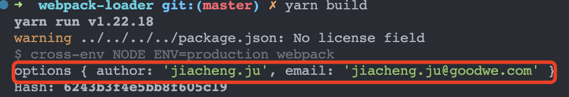
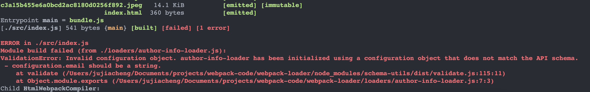

# webpack loader 的原理与实现

# 序言

对于`webpack`来说，`loader`和`plugin`可以算是需求程度最为广泛的配置项了。但是呢
，单单止步于配置可能还不够。如果我们遇到一些特殊需求，但是`webpack`又没有相关
的`loader`和`plugin`。那这个时候我们就可能得开始轮子供我们自己使用了。因此，在今
天将带领大家手写一个`loader`。

# 什么是 loader

所谓`loader`只是一个导出为函数的 JavaScript 模块
。[loader runner](https://github.com/webpack/loader-runner)会调用这个函数，然后
把上一个 loader 产生的结果或者资源文件(resource file)传入进去。函数的`this`上下
文将由`webpack`填充，并且`loader runner`具有一些有用方法，可以使 loader 改变为异
步调用方式，或者获取 query 参数。

# loader 类型与开发常用 api

## 类型

- 同步 loader：`return`或调用`this.callback`同步地返回转换后的 `content` 内容
- 异步 loader：使用`this.async()`来获取异步函数`callback`，然后通过`callback`返
  回值
- raw loader：默认情况下接受`utf-8`类型的字符串作为入参，若标记`raw`属性
  为`ture`，则入参类型为二进制数据
- pitch loader：`loader`总是从右到左被调用。有些情况下，`loader`只关
  心`request`后面的元数据(`metadata`)，并且忽略前一个`loader`的结果。在实际（从
  右到左）执行 loader 之前，会从左到右调用 loader 上 pitch 方法。例
  如[bundle-loader](https://github.com/webpack-contrib/bundle-loader/blob/master/index.js)

## 常用 api

- `this.async`：获取一个 callback 函数，处理异步
- `this.callback`：同步 loader 中，返回的方法
- `this.emitFile`：产生一个文件
- `this.query`：如果这个 loader 配置了
  [options](https://v4.webpack.docschina.org/configuration/module/#useentry) 对
  象的话，this.query 就指向这个 option 对象。如果 loader 中没有 options，而是以
  query 字符串作为参数调用时，this.query 就是一个以 ? 开头的字符串。

> _使用 loader-utils 中提供的_ >
> _[getOptions 方法](https://github.com/webpack/loader-utils#getoptions)_ _来提
> 取给定 loader 的 option。但我们值得注意的是在 loader-utils 的 3.X 版本
> getOptions 方法被删除了；如果我们需要使用 getOptions 方法，需要使用
> loader-utils 的 2.X 版本_

- `this.resourcePath`：当前资源文件的路径

# 实现一个 loader

## loader 的初始化与基本写法

现在我们有这样一个需求：给 js 文件的头部打上开发者相关的信息。比如我们打包之前文
件内容是这样的：

```JavaScript
const name = "jerry_ju"
```

则经过我们自定义的 loader 打包之后的内容应该是这样的：

```JavaScript
/** * @Author:jay * @Email:email@qq.com * /const name = 'jerry_ju'
```

首先我们在已经完成`webpack`配置的工程的根目录下新建一个`loaders`文件夹，在该文件
夹下新建一个名为`author-info-loader`的 js 文件，然后写入如下代码：

```JavaScript
module.exports = function (content) {
  const newContent = `        /**         * @Author:jerry_ju         * jujiacheng_duke@163.com         * */                ${content}
  `;
  return newContent;
};
```

然后在`webpack.config.js`中添加我们自己定义的 loader：

```JavaScript
module: {
    rules: [
      {
        test: /\.jsx?$/,
        use: [
          "babel-loader",
          {
            loader: path.resolve(__dirname, "./loaders/author-info-loader")
          }
        ],
        include: path.resolve(__dirname, "./src")
      }
    ]
  },
```

然后执行打包命令，打包结果如下：

```JavaScript
eval("__webpack_require__.r(__webpack_exports__);\n/* harmony import */ var _index_less__WEBPACK_IMPORTED_MODULE_0__ = __webpack_require__(/*! ./index.less */ \"./src/index.less\");\n/**         * @Author:jerry_ju         * jujiacheng_duke@163.com         * */\nclass Animal {\n  constructor(name) {\n    this.name = name;\n  }\n  getName() {\n    return this.name;\n  }\n}\nconst dog = new Animal(\"dog\");\nconsole.log(dog.getName());\n\n//# sourceURL=webpack:///./src/index.js?");
```

## 自定义参数的获取与校验

我们不难发现作者信息里面，我们的一些描述都写死了，这很不灵活，我们希望通
过`loader`对应的配置去获取对应的参数，我们可以在引入`loader`时候添加`options`，
具体如下：

```JavaScript
module: {
    rules: [
      {
        test: /\.jsx?$/,
        use: [
          "babel-loader",
          {
            loader: path.resolve(__dirname, "./loaders/author-info-loader")
            options: {
              author: "jiacheng.ju",
              email: "jiacheng.ju@goodwe.com"
            }
          }
        ],
        include: path.resolve(__dirname, "./src")
      }
  },
```

我们可以通过`webpack loader`提供的`this.query`这个 api 来获取`options`参数，但是
webpack 官网推荐我们使用`loader-utils`的`getOptions`函数获取参数，所以我们需要先
安装`loader-utils` `yarn add loader-utils@2.x` :::danger 这里需要注意的是
，loader-utils 中已经将 getOptions 方法给删除了，但是 webpack 官网并没有更新，所
以我们需要安装 loader-utils 的 2.x 版本。否则运行打包编译时会提示找不到
getOptions 方法。 ::: 然后我们在`author-info-loader.js`中添加获取参数的方法，如
下：

```JavaScript
const loaderUtils = require("loader-utils");
module.exports = function (content) {
  const options = loaderUtils.getOptions(this) || {};

  console.log("options", options);
  const newContent = `        /**         * @Author:${options.author}         * ${options.email}         * */                ${content}
  `;

  return newContent;
};
```

执行打包命令`yarn build`，我们可以看到我们正常获取了`options`



并且在打包后的文件中可以看到我们传入的参数被正确的写入了：

```JavaScript
/***/ "./src/index.js":
/*!**********************!*\
  !*** ./src/index.js ***!
  \**********************/
/*! no exports provided */
/***/ (function(module, __webpack_exports__, __webpack_require__) {

"use strict";
eval("__webpack_require__.r(__webpack_exports__);\n/* harmony import */ var _index_less__WEBPACK_IMPORTED_MODULE_0__ = __webpack_require__(/*! ./index.less */ \"./src/index.less\");\n/**         * @Author:jiacheng.ju         * jiacheng.ju@goodwe.com         * */\nclass Animal {\n  constructor(name) {\n    this.name = name;\n  }\n  getName() {\n    return this.name;\n  }\n}\nconst dog = new Animal(\"dog\");\nconsole.log(dog.getName());\n\n//# sourceURL=webpack:///./src/index.js?");

/***/ }),
```

在我们获取到用户的参数后，我们不可避免的需要对用户配置的参数进行校验，这时我们就
需要用到`schema-utils`，首先我们来安装它`yarn add schema-utils -D` 然后我们
在`author-info-loader.js`中添加如下代码：

```JavaScript
const loaderUtils = require("loader-utils");
const { validate } = require("schema-utils");
const schema = require("./schema.json");
module.exports = function (content) {
  const options = loaderUtils.getOptions(this) || {};
  const configuration = { name: "author-info-loader" };
  validate(schema, options, configuration);
  const newContent = `        /**         * @Author:${options.author}         * ${options.email}         * */                ${content}
  `;

  return newContent;
};
```

并且新建一个名为`schema`的 json 文件，里面存放了参数的校验规则：

```JSON
{
  "type": "object",
  "properties": {
    "email": {
      "type": "string"
    },
    "author": {
      "type": "string"
    }
  },
  "additionalProperties": false
}
```

> 具体的配置规则我们可以点击[这里](https://www.npmjs.com/package/schema-utils)查
> 看

这里我们设定用户传入的字段 email 为 string 类型，当我们把`webpack.config.js`中
的`email`参数改为数字类型，再进行打包，会发现运行出错，具体如下：



## 异步回调

假设我们现在有一个新需求，我们处理的文件时需要根据网络接口返回的结果来输出不同的
内容，这时候我们就不能直接返回结果，而是要获取一个异步`callback`函数，使用这个函
数把结果输出。代码如下：

```JavaScript
const loaderUtils = require("loader-utils");
const { validate } = require("schema-utils");
const schema = require("./schema.json");
module.exports = function (content) {
  const callback = this.async();
  const options = loaderUtils.getOptions(this) || {};
  const configuration = { name: "author-info-loader" };
  validate(schema, options, configuration);
  const newContent = `        /**         * @Author:${options.author}         * ${options.email}         * */                ${content}
  `;
  setTimeout(() => {
    callback(null, JSON.stringify(newContent), null, {});
    console.log("net done");
  }, 1000);
};
```

callback 的详细参数含义如下：

- error：错误信息，当无法转换原内容时，给 webpack 返回一个 error，该参数必须
  为`Error`或`null`
- content：转化后的内容，为`string`或`buffer`
- map：`sourceMap`相关信息
- meta：要传给下一个 loader 的额外的参数信息
