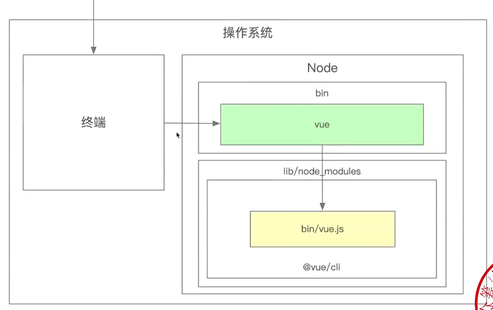

# 前端架构师笔记

## 研发流程

### 为什么需要要优化研发流程

- 项目量级增加
- 项目数量扩大
- 项目复杂度高

团队人数增长传统的项目研发流程已经无法满足业务需求。前端研发流程进化的内核：效率
、质量、性能。

### 项目创建流程思考

- 如何让上千名前端开发创建项目体验趋于一致？
- 如何高效沉淀项目中的最佳实践，并能快速复用？
- 如何在创建项目后尽可能少改动源码，最快速度投入开发？

  

### 研发模式优化思考

- 有哪些提升前端研发效率的手段？
  - 复用代码
  - 赋能产品、运营和后端非前端开发
- 如何高效使用这些工具、并且快速投入生产？
- 物料和低代码会撼动前端工程师的地位吗？、

## 前端脚手架

### 脚手架简介

脚手架的本质是一个操作系统的客户端，他通过命令执行。

### 脚手架执行原理



+ 在终端输入 `vue create vue-app`
+ 终端解析出`vue`命令
+ 终端在环境变量中找到 `vue` 命令
+ 终端根据 `vue` 命令连接到实际文件 `vue.js`
+ 终端利用 `node` 执行 `vue.js`
+ `vue.js`解析command/options
+ `vue.js` 执行command
+ 执行完毕，推出执行

### 从应用的角度如何开发一个脚手架

这里以vue-cli为例

* 开发`npm`项目，该项目中应该包含一个 `bin/vue.js`文件，并将这个项目发布到 `npm`
* 将 `npm` npm项目安装到 `node` 的 `lib/node_modules`
* 在 `node` 的 `bin`目录下配置 `vue` 软连接指向 `lib/node_modules/@vue/cli/bin/vue.js`

这样我们可以执行 `vue`命令的时候就可以找到 `vue.js` 进行执行

### 开发前端脚手架的必要性

脚手架的核心效能是提升前端研发效能

#### 脚手架核心价值

将研发过程：

+ 自动化：项目重复代码拷贝/git操作/发布上线操作
+ 标准化：项目创建/git flow/发布流程/会滚流程
+ 数据化：研发过程体系化、数据化、使得研发过程可量化

### 和自动化构建工具的区别

问题：jenkins，travis等自动化构建工具已经比较成熟了，为什么还要自研脚手架？

+ 不满足需求：jenkins，travis通常在git hooks中触发，需要在服务端执行，无法覆盖研发人员的功能，如：创建项目自动化、本地git操作等
+ 定制复杂：jenkins、trvais定制过程需要开发插件，其过程较为复杂，需要使用java语言、对前端同学不友好

### 脚手架实现原理

如果你能回答以下三个问题，就掌握了脚手架的实现原理：

* 为什么全局安装 `@vue/cli` 后会添加命令为 `vue`

```bash
npm install -g @vue/cli
```

在安装的 `@vue/cli` 的 `package.json` 的 `bin` 下进行了配置，将 `vue` 指向了 `bin/vue.js`

* 全局安装 `@vue/cli` 时发生了什么？

`Node` 会把我们的包下载到lib/node_modules，然后去解析对应的`package.json`中的`bin`配置，如果存在，会在`node`的`bin`目录下，创建一个软连接。

* 执行 `vue` 命令时发生了什么？为什么 `vue` 指向一个 `js`文件，我们却可以通过 `vue` 命令执行它？

操作系统会根据 `witch vue` 找到对应的目录，然后执行。能够执行的原因是，这个文件添加了执行环境的命令：`#!/usr/bin/env node`

### 脚手架进阶原理

* 
