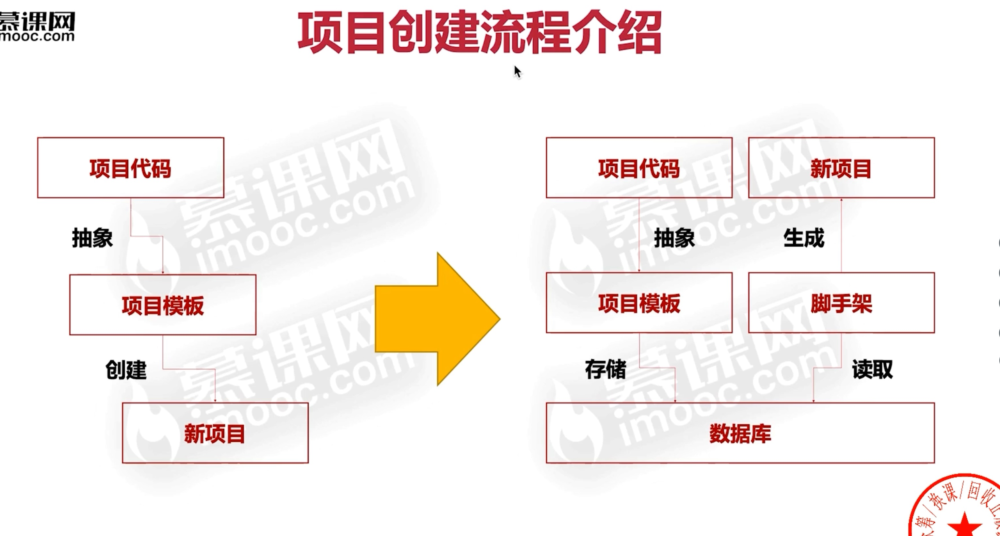

# 前端架构师笔记

## 研发流程

### 为什么需要要优化研发流程

- 项目量级增加
- 项目数量扩大
- 项目复杂度高

团队人数增长传统的项目研发流程已经无法满足业务需求。前端研发流程进化的内核：效率
、质量、性能。

### 项目创建流程思考

- 如何让上千名前端开发创建项目体验趋于一致？
- 如何高效沉淀项目中的最佳实践，并能快速复用？
- 如何在创建项目后尽可能少改动源码，最快速度投入开发？

  

### 研发模式优化思考

- 有哪些提升前端研发效率的手段？
  - 复用代码
  - 赋能产品、运营和后端非前端开发
- 如何高效使用这些工具、并且快速投入生产？
- 物料和低代码会撼动前端工程师的地位吗？
