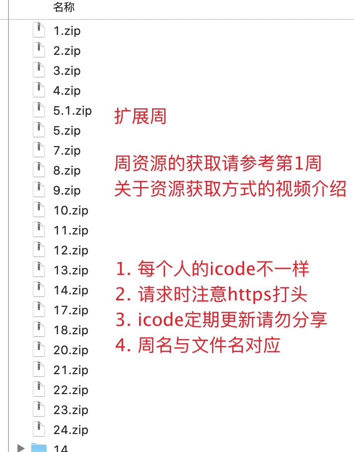
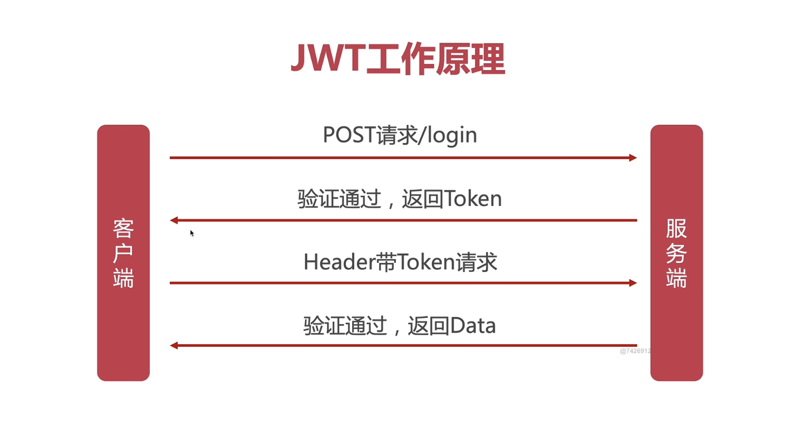

# 大前端笔记

# 资料地址

1. icode 资源：https://apis.imooc.com/new/3.zip?icode=J881E55F5C3CC1F43



# 软件安装

## mongo

执行命令：`docker pull mongo:4` 在 docker-compose 内配置`mongo`：

```Plaintext
mongodb:
     image: mongo:4
     restart: always
#容器名不能是mongo，不然进去不交互终端，神奇
     container_name: mongodb
     environment:
       MONGO_INITDB_ROOT_USERNAME: root
       MONGO_INITDB_ROOT_PASSWORD: jjc@970615
     ports:
       - 27017:27017
     volumes:
#数据持久化配置
       - /home/mydocker/mongo:/data/db
```

进入交互终端：`docker exec -it mongodb mongo`，然后即可操作

```Plaintext
show dbs
1. 输入use admin进入admin数据库root用户需要在admin数据库中认证。
2. 输入db.auth('root','jjc@970615')超级用户进行认证，用 use testdb
3. 输入db.createUser({user: "test",pwd: "123456",roles: [ { role: "dbOwner", db: "testdb" } ]} )创建okevin用户并为它指定数据库为recommended。
db.createUser({user:'bigfrontadmin',pwd:'123456',roles:[{role:'dbOwner',db:'bigfront'}]})
4. 输入db.auth('test','123456')切换认证用户。
5. 输入use testdb切换至testdb数据库
6. 输入db.repo.insert({"name":"test"})创建一条数据。


db.collection.insertOne  插入一条数据
例db.userinfo.insertOne({name: 'zhangsan', age: 19})
db.collection.updateOne 更新一条数据
例db.userinfo.updateOne({name: 'zhangsan'}, {$set: {email: 'zhangsan@qq.com'}})
db.collection.deleteOne 删除一条数据
例db.userinfo.deleteOne({name: 'lisi'})
db.collection.find()  查询
例db.userinfo.find({})
增删改查的操作
相当于文档里面的MongoDB CRUD 的操作
db.system.users.find().pretty() // 查询所有用户

use admin
switched to db admin
show users // 查库下的用户

use admin
switched to db admin
db.auth('admin','123456')
1
db.system.users.find().pretty()
{
    "_id" : "admin.root",
    "user" : "root",
    "db" : "admin",
    "credentials" : {
        "SCRAM-SHA-1" : {
            "iterationCount" : 10000,
            "salt" : "******************==",
            "storedKey" : "*****************=",
            "serverKey" : "**************="
        }
    },
    "roles" : [
        {
            "role" : "read",
            "db" : "admin"
        },
        {
            "role" : "readWrite",
            "db" : "admin"
        },
        {
            "role" : "dbAdmin",
            "db" : "admin"
        },
        {
            "role" : "userAdmin",
            "db" : "admin"
        },
        {
            "role" : "dbOwner",
            "db" : "admin"
        },
        {
            "role" : "readAnyDatabase",
            "db" : "admin"
        },
        {
            "role" : "readWriteAnyDatabase",
            "db" : "admin"
        },
        {
            "role" : "userAdminAnyDatabase",
            "db" : "admin"
        },
        {
            "role" : "dbAdminAnyDatabase",
            "db" : "admin"
        },
        {
            "role" : "hostManager",
            "db" : "admin"
        },
        {
            "role" : "clusterMonitor",
            "db" : "admin"
        },
        {
            "role" : "backup",
            "db" : "admin"
        },
        {
            "role" : "restore",
            "db" : "admin"
        },
        {
            "role" : "root",
            "db" : "admin"
        },
        {
            "role" : "dbOwner",
            "db" : "devicedb"
        },
        {
            "role" : "readWrite",
            "db" : "devicedb"
        },
        {
            "role" : "userAdmin",
            "db" : "devicedb"
        },
        {
            "role" : "dbAdmin",
            "db" : "devicedb"
        }
    ]
}
{
    "_id" : "test.test",
    "user" : "test",
    "db" : "test",
    "credentials" : {
        "SCRAM-SHA-1" : {
            "iterationCount" : 10000,
            "salt" : "******************==",
            "storedKey" : "******************=",
            "serverKey" : "******************="
        }
    },
    "roles" : [
        {
            "role" : "read",
            "db" : "test"
        },
        {
            "role" : "readWrite",
            "db" : "test"
        },
        {
            "role" : "dbAdmin",
            "db" : "test"
        },
        {
            "role" : "userAdmin",
            "db" : "test"
        },
        {
            "role" : "dbOwner",
            "db" : "test"
        }
    ]
}
```

将数据库备份到指定目录
`docker exec -it mongodb mongodump -h localhost -u root -p jjc@970615 -o /tmp/testdb`
使用 docker cp 命令将备份文件拷贝到宿主机
`docker cp mongodb_mongo_1:/tmp/testdb /tmp/testdb` 数据恢复恢复
`docker exec -it mongodb mongorestore -h localhost -u root -p jjc@970615 --dir /tmp/testdb`
注意如果 collections 有相同数据 数据恢复不成立

## 邮箱配置

POP3/SMTP 服务：**bimdasgockjmhdig** **三方登陆：mcfitnqynzkuhjac**

## redis

1. 进入 redis 容器：`docker exec -it redisserver /bin/bash`然后执行`redis-cli`
2. 登录鉴权：如果设置了密码需要输入`auth 123456`

# JWT

## 工作原理



## 算法/加密

算法中的指令描述的是一个计算，当其运行时能从一个初始状态和初始输入（可能为空）开
始，经过一系列有限而清晰的状态最终生产输出并停止于一个终态。 数据加密的基本过程
，就是对原来为明文的文件或数据按某种算法进行处理，使其成为不可读的一段代码，通常
称为“密文”。通过这样的途径，来达到保护数据不被非法人窃取，阅读的目的。


## API 安全设计

- 安全信道加密：使用 HTTPS
- 通信数据加密：密文+加密关键数据
- 通信安全策略：授权中间层、尝试次数、过期策略...

## token 在 koa 中的使用

```JSON
npm install koa-jwt -S
npm i jsonwebtoken -S
```

在入口页面引入 koa-jwt

```JavaScript
import JWT from "koa-jwt";
// 定义公共的路径，不需要jwt鉴权
const jwt = JWT({ secret: config.JWT_SECRET }).unless({ path: [/^\/api\/public/, /^\/api\/login/] });

/**
 * 使用koa-compose 集成中间件
 */
const middleware = compose([
  koaBody(),
  statics(path.join(__dirname, "../public")),
  cors(),
  jsonutil({ pretty: false, param: "pretty" }),
  helmet(),
  errorHandle, // 处理鉴权失败的方法
  jwt
]);
```

errorHandle

```JavaScript
export default (ctx, next) => {
  return next().catch((err) => {
    if (401 == err.status) {
      ctx.status = 401;
      ctx.body = {
        code: 401,
        msg: "Protected resource, use Authorization header to get access\n"
      };
    } else {
      throw err;
    }
  });
};
```

使用 jsonwebtoken 生成 jwt

```JavaScript
async login(ctx) {
    const { body } = ctx.request;
    console.log("hello login");
    try {
      let token = jsonwebtoken.sign({ _id: "jerry" }, config.JWT_SECRET, {
        expiresIn: "1d"
      });
      ctx.body = {
        code: 200,
        token
      };
    } catch (e) {
      console.log(e);
    }
  }
}
```

# 语义化版本

https://semver.org/lang/zh-CN/

../../..(/Users/jujiacheng/Documents/projects/writings/assets/前端/慕课网大前端/
大前端笔记/04.png)

# 接口定义

[https://doc.toimc.com/web/](https://doc.toimc.com/web/#/2/46)
