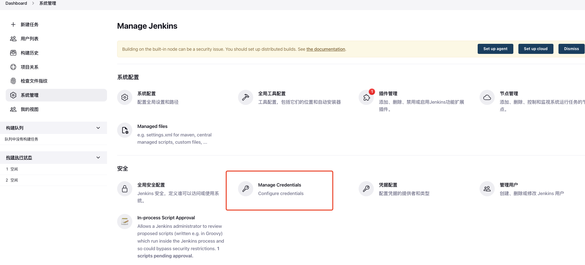
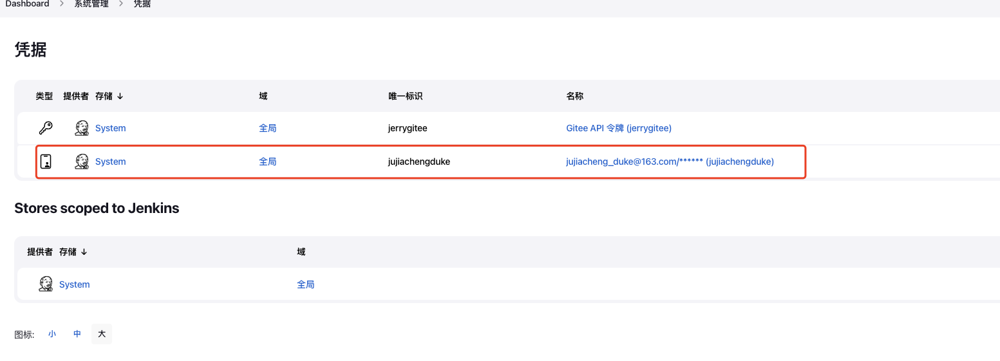

# 自动化部署

# docker-compose 的下载

在安装 docker-compose 之前记得先安装 docker

```Bash
sudo curl -L "https://github.com/docker/compose/releases/download/1.24.0/docker-compose-$(uname -s)-$(uname -m)" -o /usr/local/bin/docker-compose
```

提升 docker-compose 的权限

```Bash
sudo chmod +x /usr/local/bin/docker-compose
```

输入`docker-compose -v`查看是否成功


# docker 安装 nginx，jenkins

先获取镜像

```Bash
docker pull nginx
docker pull jenkins/jenkins:lts
docker pull mysql:8.0.28
```

执行`docker images`查看已安装镜像


然后在 home 目录下编写 nginx 和 jenkins 目录

```JavaScript
+ compose
  - docker-compose.yml  // docker-compose执行文件
+ nginx
  + conf.d
    - nginx.conf        // nginx配置
+ jenkins
   - jenkins_home       // jenkins挂载卷
+ webserver
   -static              //存放前端打包后的dist文件
```

## 编写配置文件

### docker-compose.yml

```JavaScript
version: '3'
services:                                      # 集合
  docker_jenkins:
    user: root                                 # 为了避免一些权限问题 在这我使用了root
    restart: always                            # 重启方式
    image: jenkins/jenkins:lts                 # 指定服务所使用的镜像 在这里我选择了 LTS (长期支持)
    container_name: my-jenkins                    # 容器名称
    ports:                                     # 对外暴露的端口定义
      - 8080:8080
      - 50000:50000
    volumes:                                   # 卷挂载路径
      - /home/jenkins/jenkins_home/:/var/jenkins_home  # 这是我们一开始创建的目录挂载到容器内的jenkins_home目录
      - /var/run/docker.sock:/var/run/docker.sock
      - /usr/bin/docker:/usr/bin/docker                # 这是为了我们可以在容器内使用docker命令
      - /usr/local/bin/docker-compose:/usr/local/bin/docker-compose
  docker_nginx:
    restart: always
    image: nginx
    container_name: my-nginx
    ports:
      - 8090:80
      - 80:80
      - 443:443
    volumes:
      - /home/nginx/conf.d/nginx.conf:/etc/nginx/nginx.conf
      - /home/webserver/static/jenkins/dist:/usr/share/nginx/html
```

### nginx.conf

```JavaScript
user root;
worker_processes auto;

error_log  /var/log/nginx/error.log notice;
pid        /var/run/nginx.pid;


events {
    worker_connections  1024;
}


http {
    include       /etc/nginx/mime.types;
    default_type  application/octet-stream;

    log_format  main  '$remote_addr - $remote_user [$time_local] "$request" '
                      '$status $body_bytes_sent "$http_referer" '
                      '"$http_user_agent" "$http_x_forwarded_for"';

    access_log  /var/log/nginx/access.log  main;

    sendfile        on;
    #tcp_nopush     on;

    keepalive_timeout  65;

    #gzip  on;

    include /etc/nginx/conf.d/*.conf;
    server {
        listen       80;
        server_name localhost;
        location / {
            root   /usr/share/nginx/html;
            try_files $uri $uri/ /index.html last;
            index  index.html index.htm;
        }
        error_page   500 502 503 504  /50x.html;
        location = /50x.html {
            root   html;
        }
    }
}
```

编写完成后进入/home/compose 目录输入以下命令，启动环境：

```JavaScript
docker-compose up -d
docker-compose stop //停止nginx和jenkins 两者结合可以进行重启
```

输入`docker ps -a`可查看容器情况

# jenkins 配置

在浏览器内输入公网 ip:8080 进入 jenkins 配置页


到页面中提示的路径下找到密码后，按照提示，进入下一步，安装推荐配置(由于我们是通
过 docker 安装的所以这个路径在 mydocker 下)


安装完成之后，选择左侧 Manage Jenkins 选项。如下图所示：


## 插件安装

### 安装 gitee 插件


记住安装完插件后重启 jenkins 否则不会生效

### 配置 gitee

在[Jenkins] > [系统管理] > [系统配置] > [Gitee 配置] 配置 `Gitee` 信息：


- 链接名：输入 Gitee 或随便输入你想要的名称
- Gitee 域名 URL：输入 Gitee 完整的 URL 地址 https://gitee.com
- 证书令牌：如没有添加需要新建一个，点击添加（如下图）


- Domain：选择全局凭据
- 类型：选择 Gitee API 令牌
- 范围：选择全局
- Gitee APIV5 私人令牌
  ，[点击获取](https://gitee.com/profile/personal_access_tokens)
- ID 和 描述就随便写不一样的就行

添加完令牌就直接选择就行，然后点击【测试链接】，如果出现成功则表示配置正确：


### **安装 NodeJS**


### 配置 nodejs

在[系统管理] > [系统配置] > [全局工具配置] > [NodeJS] 点击【NodeJS 安装】：


# 配置构建任务

## 前端

在 Jenkins 首页点击【新建任务】开始第一个流水线的构建，选择构建一个自由风格的软
件项目 点击保存即可创建构建项目：


新建完成后进入配置，流水线会按照 [General] > [源码管理] > [构建触发器] >
[构建环境] > [构建] > [构建后操作]的步骤来执行自动化任务。


### 源码管理

- 选择 Git 选项
- Repository URL: 创建的 git 项目地址
- Credentials：点击添加一个凭据（注意 Gitee API Token 凭据不可用于源码管理的凭据
  ，只用于 gitee 插件的 API 调用凭据）
- 点击【高级】 Advanced 按钮，Name 输入 origin，Refspec 输入
  +refs/heads/_:refs/remotes/origin/_
- 指定分支：master


### 发布构建

这里选择配置 push 代码立即触发构建任务，勾选 Gitee webhook 触发构建，后面有个地
址这个后面需要配置到 Gitee，Gitee 触发构建策略勾选推送代码，其他先默认就行。


后面有个 Gitee WebHook 密码 栏位需要配置到 Gitee，点击生成就会生成一个密码：


打开 Gitee 项目的管理选项卡，左侧有个[WebHooks]菜单 ，点击【添加 webHook】

### 构建环境

修改构建任务的构建环境，勾选 Provide Node & npm bin/ folder to PATH ，默认会选择
Jenkins 安装的 NodeJS 版本:


### 构建脚本

选择【执行 shell】：


### 安装插件 Publish Over SSH


生成服务器密钥，然后：


先添加一个 Transfer Set 删除部署目录的文件，我这里把文件放在了
/home/webserver/static/jenkins/dist


再加一个 Transfer Set 传送文件到部署目录：


这里的 Remote directory 是相对路径，与刚刚 publish over ssh 的 Remote directtory
合并成最终的文件生成目录

### 构建后操作

构建完成重启 nginx 容器，否则不会生效或报 403


最后删除 workspace 节约空间

## 后端（nodejs）

### 编写 Dockerfile

在 zinodejs 工程的根目录下新建一个 Dockerfile，D 一定要大写，具体如下：

```Dockerfile
FROM node:alpine
COPY . .
RUN  npm install pm2  -g

CMD pm2-runtime /dist/index.js
```

### jenkins 配置

先新建一个流水线


gitee 链接配置方式参考前端，勾选参数化构建过程


选择字符参数，具体配置如下：


这些是我需要用到的字符，当然你也可以自己配置，这些参数会在后面的 Pipleline
script 中使用到，构建触发器的选择参考前端项目的配置。

### Pipline script

```Bash
pipeline {
    agent any

    stages {
        stage('获取代码'){
                        steps{
                                echo "拉取代码"
                                cleanWs()
                                git branch: 'master',
                                credentialsId: 'jujiachengduke',
                                url: 'https://gitee.com/dukeju/my-back-end.git'
                        }
                }
                stage('打包'){
            steps {
                // Get branch lastest code from a GitHub repository
                echo 'build start......'
                nodejs('node16.15.1'){
                    // 安装依赖
                    sh 'node -v'
                    sh 'npm -v'
                    sh 'npm config set registry http://registry.npm.taobao.org'
                    //npm install
                    sh 'npm install'
                    // 打包构建
                    sh 'npm run build'
                    sh 'pwd'
                    sh 'ls'
                    // 控制台打印
                    echo "build success..."
                }
            }
        }
        stage('构建镜像'){
            steps {
                echo 'image start......'
                sh 'docker build --no-cache -t ${image_name}:${tag} .'
                echo 'image successful'
            }
        }
        stage('应用部署'){
            steps {
                echo 'container start......'
                sh 'docker stop ${container_name} || true && docker rm ${container_name} || true'
                sh 'docker run -itd --name ${container_name} -p ${port}:3000 --env NODE_ENV=prod ${image_name}:${tag}'
            }
        }
    }
}
```

注意：

1. ${}内的参数即为在参数化构建中配置的参数
2. credentialsId 为我们之前自己配置的 gitee 账号密码的 id，查看方法如下

【系统管理】-->Manage Credentials





这是我的配置将唯一标识填到 credentialsId 后即可
