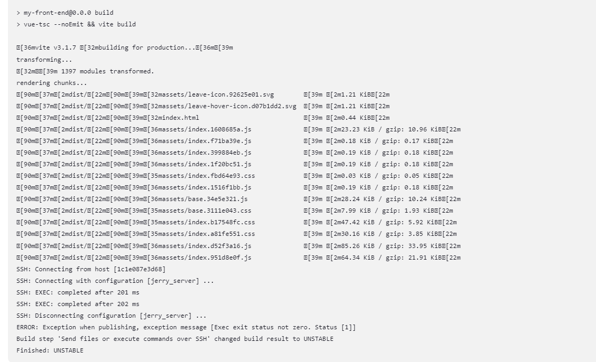
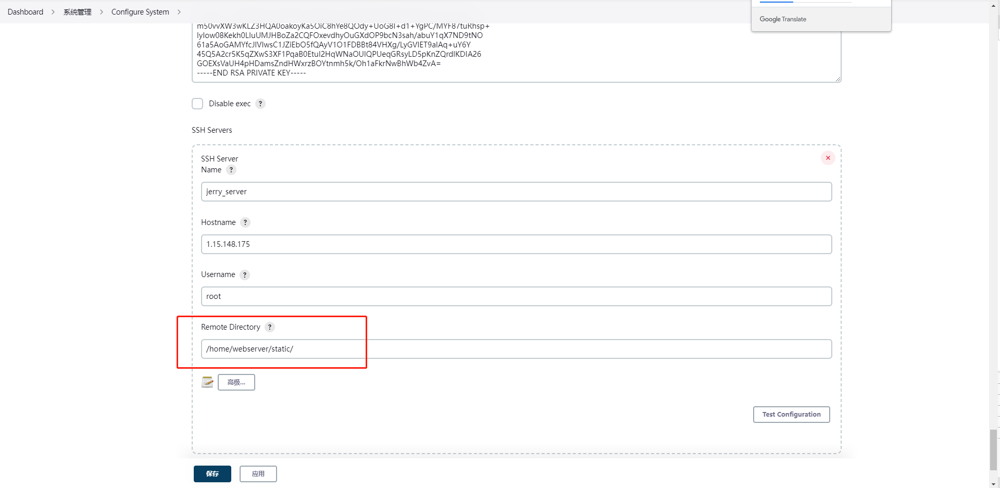

# 'Send files or execute commands over SSH' changed build result to UNSTABLE 的可能性

## 情况一：输出路径不对

这里全局的 Remote Directory 是绝对路径

工程内部的 Remote Directory 是相对路径，和全局的 Remote Directory 两者拼接后为打
包后的输出路径，切记切记
