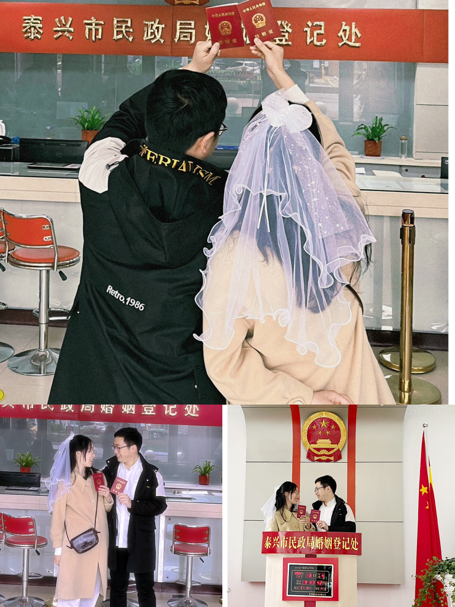

# 2023年终总结

# 买房结婚

今年上半年主要完成了两件大事，一件是在苏州买了房，过上了还房贷的日子，说实话压力还是有的，每个月除了日常开销有多了一笔支出，加油吧少年，努力奋斗；另一件是我结婚啦，和夫人的七年爱情长跑终于有了结果哈哈，开心。

但是今年上半年也有些不尽如人意的地方，一个是奶奶中风了住院；一个是老妈子宫肌瘤，做了子宫切除手术。回去看老妈的时候，老妈以肉眼可见的速度老了，爸爸的身体也在不断的变老。父母已经渐渐老去，我不能再做那个无忧无虑的小孩了，再加上现在已经有了我自己的小家。该承担的责任不应该再逃避了，该承担起来了！

# 工作中

说实话上半年的工作蛮混乱的，公司先是经历了故事池模式大家疯狂的去抢故事，导致我Q2绩效奇低，并且直接导致今年的涨薪名单并没有我。而且由于上半年忙着买房与结婚的事在自我提升上并没有下多少功夫。这一点下半年要改正。 虽然这次涨薪没有我，但是由于现在大环境太差，外面的工作并不是那么的好找，所以下半年到明年上半年我的主要精力应该还是要放在自我技术提升上，而且再频繁跳槽我的简历就太花了。 下半年的计划如下

1. 重新开始算法，日积月累《算法》这本书可以开始看了
2. 背单词持之以恒，不要间断
3. lerna要学
4. 微前端，掘金小册
5. 《沟通的艺术》
6. 《Vue.js设计与实现》
7. 《React设计原理》
8. 考个pmp或者软考中级

先这么多吧，加油自己强大了才会无所畏惧！！