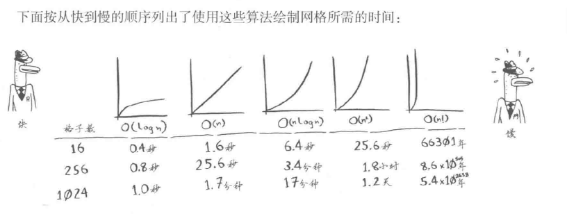
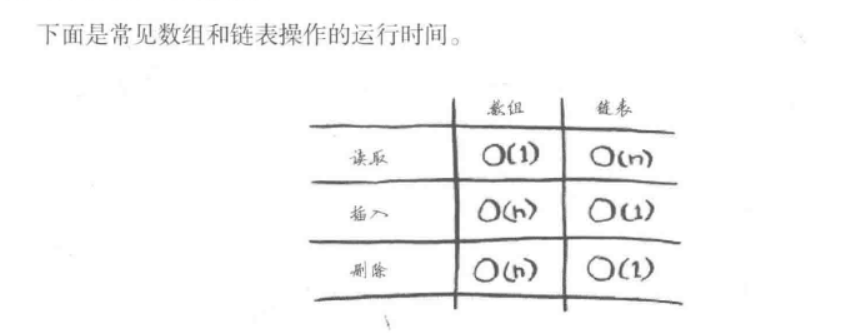

# 常用算法

## 数据结构

- 计算机存储，组织数据的方式

## 时间复杂度

- 一个函数，定性描述该算法的运行时间

### 大 O 表示法

- 大 O 表示法是一种特殊的表示法，指出了算法速度有多快
- 大 O 表示法指出了最糟糕情况下的运行时间
- 一些常见的大 O 运行时间
  - O(logn),对数时间，这样的算法包括二分查找
  - O(n)，线性时间，这样的算法包括简单查找
  - O(n\*logn)，这样的算法包括快速排序---一种比较快的排序算法。
  - O(n2)，这样的算法包括选择排序---一种比较慢的排序算法。
  - O(n!)，这样的算法包括旅行商问题的解决方案----一种非常慢的算法。
  - 

#### 总结

- 算法的速度指的并非时间，二十操作数的增速。
- 谈论算法的速度时，我们说的是随着输入的增加，其运行时间将以什么样的速度增加。
- 算法的运行时间用大 O 表示法表示。
- O(logn)比 O(n)快，当需要搜索的元素越多时，前者比后者快的越多。

## 空间复杂度

- 一个函数，算法在运行过程中临时占用存储空间大小的度量

## 栈

### 什么是栈

- 一个后进先出(先进后出)的数据结构
- js 中没有栈，但可以用 Array 实现栈的所有功能(push--入栈; pop--出栈)

### 使用场景

- 所有需要后进先出的场景: 十进制转二进制，判断字符串中的括号是否有效，函数调用堆
  栈

### 前端与栈：JS 中的函数调用堆栈

- 断点调试 callStack.js

## 队列

- 一个先进先出的数据结构
- js 中没有队列，但可以使用 Array 实现队列所有功能

### 使用场景

- 所有需要先进先出的场景，js 异步中的任务队列，计算最近请求的次数

## 链表

- 多个元素组成的列表。
- 元素存储不连续，用 next 指针连在一起。
- 与数组的区别：数组增删非首尾元素时往往需要易懂元素；而链表增删非收尾元素，不需
  要移动元素，只需要更改 next 的指向即可。
- js 中没有链表，可以用 Object 模拟链表



### js 中的原型链

- 原型链本质是链表
- 原型链上的节点是各种原型对象，比如：Function.prototype、Object.prototype...
- 原型链通过`__proto__`属性连接各种原型对象

### 原型链知识点

- 如果 A 沿着原型链能找到 B.prototype，那么 `A instanceof B` 为 true
- 如果 A 对象上没有 x 属性，则会沿着原型链往上找

## 集合

- 一种无序且唯一的数据结构
- ES6 中有集合，名为 Set
- 集合的常用操作：去重、判断元素是否在集合中，求交集

## 字典

- 与集合类似，字典也是一种存储唯一值的数据结构，但它是以键值对的形式来存储
- es6 中有字典，Map
- 字典的常用操作：健值对的增删改查

## 树

- 一种分层数据的抽象模型
- 前端常见的树：DOM 树，级联选择，树形控件
- js 中没有树，可以通过 Object 和 Array 构建树

```JavaScript
{
  label: 'a',
    value: 'aaa',
      children: [
        {
          label: 'a-a',
          value: 'a-aaa'
        }
      ]
}
```

### 常用操作

- 深度/广度优先遍历；对于二叉树还是有先中后序遍历

#### 深度优先遍历

- 尽可能深的搜索树的分支
  - 访问根节点
  - 对根节点的 children 挨个进行深度优先遍历

#### 广度优先遍历

- 先访问离根节点近的节点
  - 新建一个队列，把根节点入队
  - 把队头出队并访问
  - 把队头的 children 挨个入队。
  - 重复第二，第三步知道队列为空

### 二叉树

- 树中每个节点最多只能有两个字节点
- 在 js 中通常用 Object 来模拟二叉树

#### 先序遍历口诀

1. 访问根节点
2. 对根节点的左子树进行先序遍历
3. 对根节点的右子树进行先序遍历

#### 中序遍历口诀

1. 对根节点的左子树进行中序遍历
2. 访问根节点
3. 对根节点的右子树进行中序遍历

#### 后序遍历口诀

1. 对根节点的左子树进行后序遍历
2. 对根节点的右子树进行后序遍历
3. 访问根节点

## 图

- 图是网络结构的抽象模型，是一组由边连接的节点
- 图可以表示任何二元关系，比如道路航班。。。
- js 中没有图，但是可以用 Object 和 Array 构建图
- 图的表示法：临接矩阵、临接表、关联矩阵。。。

### 常用操作

- 深度优先遍历：尽可能深的搜索图的分支
  - 访问根节点。
  - 对根节点的没有访问过的相邻节点挨个进行深度优先遍历。
- 广度优先遍历：现访问离根节点最近的节点。
  - 新建一个队列，把根节点入队。
  - 把队头出队并访问。
  - 把队头的每访问过的相邻节点入队。
  - 重复 2，3 直到队列为空

## 堆

- 堆是一种特殊的完全二叉树
- 所有的节点都大于等于（最大堆）或小于等于（最小堆）他的字节点
- js 中通常用数组表示堆
- 左侧字节点的位置是 2\*index+1
- 右侧字节点的位置是 2\* index+2
- 父节点位置是(index-1)/2
- 快速高效的找出最大值和最小值：时间复杂度:O(1)
- 找出第 k 个最大最小值

### 第 K 个最大元素

1. 构建一个最小堆
2. 当对的容量超过 k，就删除堆顶
3. 插入结束后，堆顶就是第 k 个最大元素

### js 实现最小堆类

1. 在类里，申明一个数组，用来装元素。
2. 主要方法：插入，删除堆顶，获取堆顶，获取堆大小

## 递归

1. 检查元素中的每一层
2. 如果没有找到想要的元素，返回 1
3. 如果找到想要的元素则大功告成

## 排序和搜索

- 排序：把某个乱序的数组变成升序或者降序的数组
- 搜索： 找出数组中某个元素的下标

### js 中的排序和搜索

- js 中排序：数组的 sort 方法
- js 中的搜索：数组的 indexOf 方法

### 排序算法(以从小到大排序为例)

- 冒泡排序
  - 比较所有的相邻元素，如果第一个比第二个大，则交换它们
  - 一轮下来可以保证最后一个元素是最大的
  - 执行 n-1 轮，就可以完成排序
  - 时间复杂度 O(n2)
- 选择排序
  - 找到数组中的最小值，选中并将其放在第一位
  - 接着找到第二小的值，选中它将其放到第二位
  - 此类推，执行 n-1 轮
  - 时间复杂度 O(n2)

```JavaScript
Array.prototype.selectionSort = function () {
  for (let i = 0; i < this.length - 1; i++) {
    let indexMin = i;
    for (let j = i; j < this.length; j++) {
      if (this[j] < this[indexMin]) {
        indexMin = j;
      }
    }
    if (indexMin !== i) {
      const temp = this[i];
      this[i] = this[indexMin];
      this[indexMin] = temp;
    }
  }
};
```

- 插入排序
  - 从第二个数开始往前比
  - 比它大就往后排
  - 以此类推进行到最后一个数
  - 时间复杂度 O(n2)
- 归并排序
  - 分：把数组劈成两半，在递归的对子数组进行"分"操作，直到分成一个个单独的数。
  - 合：把两个数合并为有序数组，再对有序数组进行合并，直到全部子数组合并为一个完
    整数组。
  - 新建一个空 res。用于存放最终排序后的数组，比较两个有序数组的头部，较小者出队
    并推入 res 中，如果两个数组还有值，就重复第二步
  - 时间复杂度 O(nlgn)
- 快速排序
  - 分区：从数组中任意选择一个“基准”，所有比基准小的元素放在基准前面，比基准大的
    元素放在基准的后面
  - 递归：递归的=地对基准前后的子数组进行分区
  - 时间复杂度 O(nlogN)

```JavaScript
Array.prototype.quickSort = function () {
  const rec = (arr) => {
    if (arr.length <= 1) return arr;
    const left = [];
    const right = [];
    const mid = arr[0];
    for (let i = 1; i < arr.length; i++) {
      if (arr[i] < mid) {
        left.push(arr[i]);
      } else {
        right.push(arr[i]);
      }
    }
    return [...rec(left), mid, ...rec(right)];
  };
  const res = rec(this);
  res.forEach((n, i) => {
    this[i] = n;
  });
};
```

### 搜索算法

- 顺序搜索
  - 遍历数组
  - 找到根目标值相等的元素，就返回他的下标
  - 遍历结束后，如果没有索索到目标，就返回-1
  - 时间复杂度 O(n)
- 二分搜索(数组一定要有序)
  - 从数组的中间元素开始，如果中间元素正好是目标值，则搜索结束
  - 如果目标值大于或者小雨中间元素，则在大雨或小雨中间元素的那一半数组中搜索
  - 时间复杂度 O(logN)

```JavaScript
Array.prototype.binarySearch = function (item) {
  let low = 0;
  let high = this.length - 1;
  while (low <= high) {
    const mid = Math.floor((low + high) / 2);
    const element = this[mid];
    if (element < item) {
      low = mid + 1;
    } else if (element > item) {
      high = mid - 1;
    } else {
      return mid;
    }
  }
  return -1;
};
```

## 分而治之

- 分而治之是算法设计中的一种方法
- 它将问题分成多个和原问题相似的小问题，递归解决小问题，再将结果合并以解决原来的
  问题。

### 场景一：归并排序

- 分：把数组从中间一分为二
- 解：递归的对两个字数组进行归并排序
- 合：合并有序子数组

### 场景二：快速排序

- 分：选基准，按基准把数组分成两个子数组
- 解： 递归地对两个子数组进行快速排序
- 合： 对两个子数组进行合并
